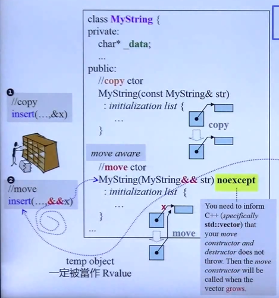

# 1 auto

1. With C++11, you can declare a variable or an object without specifying its specific type by using auto. For example:

   C++11中你可以通过auto声明一个变量或者对象而不需要指定它的类型。例如：

```c++
// auto 告诉编译器说，我现在也不知道这个变量是什么Type，你就自己往我推吧
auto i = 42;                     // i has type int
double f();  auto d = f();       // d has type double
```

2. The type of a variable declared with auto is deduced from its initializer. Thus, an initialization is required：( 使用auto声明的变量的类型是从它的初始化器推导出来的。因此，需要初始化 ）

```c++
auto i;                          // ERROR: can’t dedulce the type of i
```

3. Additional qualifiers are allowed. For example：可以附加修饰词。例如：static auto vat = 0.19;

```c++
static auto vat = 0.19;
```

4. Using auto is especially useful where the type is a pretty long and/or complicated expression. For example：( 当类型名比较长或者相对复杂的表达式中使用auto尤其有用。例如：)

```c++
vector<string> v;
...
auto pos = v.begin();            // pos has type vector::iterator

auto l = [] (int x)->bool        // l has the type of a lambda
{  ...      };                   // taking an int and returning a bool
```

5. 使用auto前后对比

```c++
list<string> c;
list<string>::iterator ite;
ite = find(c.begin(), c.end(), target);
// 使用auto后
list<string> c;
auto ite= find(c.begin(), c.end(), target);
```


# 2 decltype

1. By using the new decltype keyword, you can let the compiler find out the type of an expression. This is the realization of the often requested typeof feature.However, the existing typeof  implementations were inconsistent and incomplete, so C++11 introduced a new keyword. 通过使用新的decltype关键字，可以让编译器找出表达式的类型。这就是通常要求的特性类型的实现。然而，现有`typeof ` 的实现不一致且不完整，因此c++ 11引入了一个新的关键字。 
2. For example

```c++
map<string, float> coll;
decltype(coll)::value_type elem;     // 相当于： map<string, float>::value_type elem;
```

3. decltype应用 1：used to declare return types.

```c++
template<typename T1, typename T2>
auto add(T1 x, T2 y)->decltype(x+y)  // 编译通不过 decltype(x+y) add(T1 x, T2 y)
```

4. decltype应用 2：in metaprogramming  元程序设计（在模板里边的应用）

```c++
template<typename T>
void test18_decltype(T obj)
{
    map<string, float>::value_type elem1;
    
    map<string, float> coll;
    decltype(coll)::value_type elem2;
    
    typedef typename decltype(obj)::iterator iType;       
}

// typedef typename decltype(obj)::iterator iType; 
// 只要加上 :: 注意前边就有就要加typename，帮助编译器确认decltype(obj)::iterator 整个是一个typename，因为编译这一段的时候 obj是什么还不知道
```

5. decltype应用 3：used pass the type of a lambda

```c++
auto cmp = [](const Person& p1, const Person& p1) { ... }
std::set<Person, decltype(cmp)> coll(cmp);
// 面对lambda，我们手上往往只有object，没有Type，要获得其Type就要借助于decltype
```


# 3 type Alias 类型化名

1. 类型别名：类型别名声明引入一个名字，可用做类型标识所指代的类型的同意词。它不引入新类型，且不能更改既存类型名的含义。类型别名声明和[typedef](https://zh.cppreference.com/w/cpp/language/typedef)声明之间无区别。此声明可出现于块作用域、类作用域或命名空间作用域。

```c++
// type alias,identical to
typedef void (*func)(int, int);
using func = void(*)(int, int);
// func是一个函数指针
void example(int, int) {}
func fn = example;
```

2. 化名模板：别名模板是一种模板，当其特化时等价于以别名模板的模板实参来替换 **类型标识** 中的模板形参的结果。

```c++
template<class CharT> 
using mystring = std::basic_string<CharT, std::char_traits<CharT>>;
mystring<char> str;

template<class T>
using Vec = vector<T, Alloc<T>>;    // 类型标识为 vector<T, Alloc<T>>
Vec<int> v;                         // Vec<int> 同 vector<int, Alloc<int>>
```

3. 对类成员的using 声明

```c++
protected:
    using _Base::M_allocate;      // 在class中using声明，之后写代码只用写M_allocate，就可以了
```

4. using namespace指令和using声明namespace成员

```c++
using namespace std;
using std::cout;
```


# 4 右值引用与Move

## 4.1 右值引用

1. Rvalue references are a new reference type introduced in C++0x that help solve the problem of unnecessary copying and enable perfect forwarding. When the right-hand side of an assignment is an rvalue, then the left-hand side object can steal resources from the right-hand side object rather than performing a separate allocation, thus enabling move semantics.  Rvalue引用是c++ 0x中引入的一种新的引用类型，它有助于解决不必要的复制问题并支持完全转发。当一个赋值的右边是一个右值时，左边的对象可以从右边的对象中窃取资源，而不是执行一个单独的分配，因此支持移动语义。

2. 左值（就是变量）与 右值

* 右值不可以出现在操作符 = 的左边
* 那什么是右值呢？临时对象

```c++
// 以 int试验：
int a = 9;
int b = 4;
a + b = 42;                                        // Error a + b就是一个右值
```

```c++
// 以string试验：
string s1("hello");
string s2("world");
s1 + s2 = s2;                                      // 竟然能通过编译，s1 + s2 可以作为左值
cout << "s1:" << s1 << endl;                       // s1:hello
cout << "s2:" << s2 << endl;                       // s2:world
string() = "world";                                // 竟然可以对临时对象，临时对象就是一个右值
```

```c++
// 以complex试验：
complex<int> c1(12, 4), c2(1, 3);
c1 + c2 = complex<int>(4, 9);                      // c1 + c2可以当作左值吗？ yes
cout << "c1:" << c1 << endl;                       // c1(12, 4)
cout << "c2:" << c2 << endl;                       // c2(1, 3)
complex<int>() = complex<int>(4, 9);               // 竟然可以对临时对象，临时对象就是一个右值
// c++及其用户定义类型在可修改性和可赋值性方面引入了一些微妙之处，这些细微之处会导致此定义不正确。我们没有必要再深入下去了
```

3. 右值引用：当右值出现在 operator=(copy assignment)的右侧，我们认为对其资源进行偷取/搬移(move) 而非拷贝(copy)是可以的，是合理的。那么：必须有语法让我们在调用端告诉编译器，这是个右值。

```c++
int foo() { return 5; }
....
int x = foo();          // ok
int *p = &foo();        // Error 对函数的返回值东西取地址，函数返回的东西是一个右值，对右值取地址不可以
foo() = 7;              // Error
```

4. 我作为一个动作的发起者（insert），我放的是一个右值，不管我是move里边放一个左值 ` std::move(c1)  `还是一个临时对象 ` Vtype(buf) `，我都是一个右值。我允许被偷，那我必须告诉 insert 这个函数，我是一个右值欢迎你来偷。insert接受端，必然要有新的版本出来，接受这种新的语法，也就是右值的语法 `insert(....&& x) `。所以在C++2.0之前，容器的语法只有 `inser( ..., & x) ` 这一个版本，2.0之后，多了一个`  insert(....&& x) `版本，于是 insert 通知`  insert(....&& x) `版本。这个版本要怎么偷呢？所谓偷，是要处理你给它的东西，以这个例子，你给它的是这一种` Vtype(buf) ` MyString 类型，当它要偷，要拷贝的时候，它就跑到 `MyString(MyString && str) noexcept` 这里来。

```c++
template<typename M>
void test_moveable(M c, long& value)
{
	char buf[10];
	typedef typename iterator_traits<typename M::iterator>::value_type Vtype;
	//clock_t timeStart = clock();
	for (long i = 0; i < value; ++i)
	{
		snprintf(buf, 10, "%d", rand());
		auto ite = c.end();
		c.insert(ite, Vtype(buf));           //调用insert(....&& x)
	}
}
```




```c++
// vector insert源码
iterator insert(const_iterator _Where, const _Ty& _Val)
{	// insert _Val at _Where
	return (emplace(_Where, _Val));
}
iterator insert(const_iterator _Where, _Ty&& _Val)               // move aware
{	// insert by moving _Val at _Where
	return (emplace(_Where, _STD move(_Val)));
}
```


## 4.2 perfect forwarding

1. Perfect forwarding allows you to write a single function template that takes n arbitrary arguments and forwards them transparently to another arbitrary function. The nature of the argument (modifiable, const, lvalue or rvalue) is preserved in this forwarding process.   Perfect forwarding允许您编写一个函数模板，该模板接受n个任意参数，并将它们透明地转发给另一个任意函数。参数的性质(可修改的、const、lvalue或rvalue)在这个转发过程中保持不变。

```c++
template<typename T1, typename T2>
void functionA(T1 && t1, T2&& t2)
{
    functionB(std::forward<T1>(t1), std::forward<T2>(t2));
}
```


### 4.2.1 不完美转交

```c++
void process(int & i)  { cout << "process(int&):"  << i << endl; }
void process(int && i) { cout << "process(int&&):" << i << endl; }
void forward(int &&i)
{ 
    cout << "forward(int&&):" << i << ",";
    process(i);
}

int a = 0;
process(a);               // process(int&):0
process(1);               // process(int&&):1  临时对象被视为右值处理
process(move(a));         // process(int&&):0  强制将a由左值改为右值

/**   右值经由forward()传给另一函数却变成左值，原因是传递过程中它变成了一个nameed object **/
forward(2);               // forward(int&&):2,process(int&):2
forward(move(a));         // forward(int&&):0,process(int&):0

forward(a);               // Error cannot bind 'int' lvalue to 'int&&'    
const int& b = 1;
process(b);               // Error no matching function for call to 'process(const int&)'
process(move(b));         // Error no matching function for call to
```


### 4.2.2 完美转交

```c++
// forward源码
template<typename _Tp>
constexpr _Tp&& forward(typename std::remove_reference<_Tp>::type& __t) noexcept
{ return static_cast<_Tp&&>(__t); }

template<typename _Tp>
constexpr _Tp&& forward(typename std::remove_reference<_Tp>::type&& __t) noexcept
{
    static_assert(!std::is_lvalue_reference<_Tp>::value, "template argument"
		    " substituting _Tp is an lvalue reference type");
    return static_cast<_Tp&&>(__t);
}
```

## 4.3 写一个move aware class


