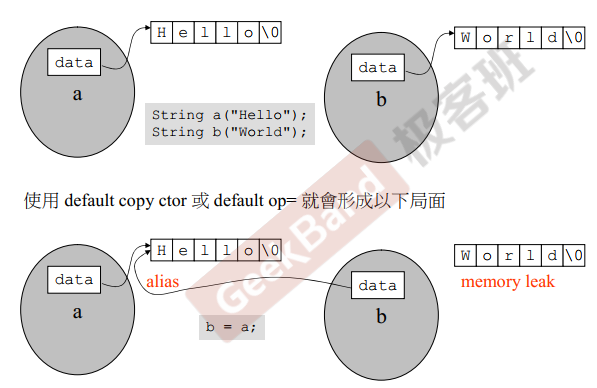
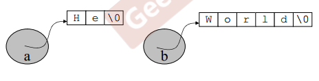
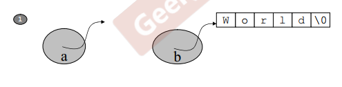
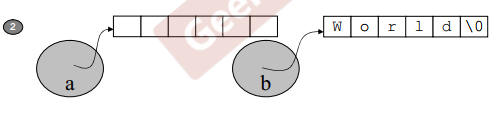
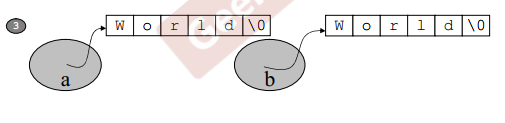
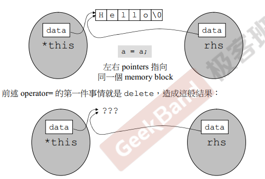

# class的两个经典分类及设计

1. 培养正规的、大气的编程习惯
2. 以良好的方式编写 C++ class （ 基于对象： 面对的是单一 class的设计）

> Classes的两个经典分类：
>
> class without pointer members -- Complex  
>
> class with pointer members  -- String

3. 学习Classes之间的关系 （ 面向对象 ：面对的是多重classes的设计，class与class之间的关系）

> 继承、复合、委托

## 1 class without pointer members -- Complex 

1. 详见：设计一个Class需要注意的问题

## 2 class with pointer members - string类的实现过程

### 1.1 成员数据设计

1. 字符串类的两种设计：

* 类里边放一个数组，用于存放字符；
* 另一种，存放一个字符指针，new的方式动态分配

2. 采用存放一个字符指针，new的方式动态分配的方式，成员数据 **char * m_data;**

### 1.1 构造函数

1.  与class同名，无返回值，参数接收什么样的初值（char*），参数只是用于做初值所以加const，并设有默认值

```c++
String(const char* cstr = 0)
{
	if (cstr)
	{
		m_data = new char[strlen(cstr) + 1];
		strcpy(m_data, cstr);
	}
	else
	{
		m_data = new char[1];
		*m_data = '\0';
	}
}
```

### 1.2 析构函数 -big three

```c++
~String()
{
	delete[] m_data;
}
```

### 1.3 拷贝构造 -big three

1. 无返回值，参数为类类型，第一优先考虑传reference，参数只作为蓝本所以加const
2. 来源端当成蓝本，拷贝到目的端

```c++
String(const String& str)
{
	m_data = new char[strlen(str.m_data) + 1];
	strcpy(m_data, str.m_data);
}
// 调用
{
    String s1("hello,world!");
    String s2(s1);   
}
```

* **class with pointer members 必须有赋值拷贝与拷贝构造**，如果使用默认的赋值拷贝与拷贝构造，两个指针指向同一块内存空间，浅拷贝，导致内存泄漏




### 1.4 拷贝赋值 -big three

1. 拷贝赋值，右边对象赋值给左边对象，

2. 拷贝赋值三步： 清空左边对象内存空间、分配足够大的空间、来源端复制给目的端



* 拷贝赋值第第一步： 清空左边对象内存空间



* 拷贝赋值第二步：分配足够大的空间



* 拷贝赋值第三步：来源端复制给目的端



3. 如何不是连续赋值，返回值可以设计为void，但如果是连续/连串赋值，则必须设计为类类型

```c++
String& operator=(const String& str) // & 在type的后边是一个引用，在对象前面是取地址
{
	if (this == &str)   // 拷贝赋值要关注自我赋值，来源端与目的端相同
		return *this;
	delete[] m_data;    // 数据从来源端到目的端，目的端是已经存在的东西，先清除目的端对象内存空间
	m_data = new char[strlen(str.m_data) + 1];  // 分配足够大的空间
	strcpy(m_data, str.m_data); // 来源端复制给目的端
	return *this;	            // 与 cout << c3 << endl; 与 s3 = s2 = s1;类似
}
// 调用
{
    String s1("hello,world!");
    String s2;
    s2 = s1;
}
```

4. 拷贝赋值要关注自我赋值，来源端与目的端相同，自我赋值检查，不仅仅是效率的问题，也是准确性的问题，拷贝赋值如果是自我赋值，*this与rhs指向同一块内存，拷贝赋值第一步，清除目的端也就是清除\*this 与rhs，当企图访问（也就是存取），产生不确定行为。



### 1.5 实现


```c++
//    辅助函数：
//    get_c_str(): 希望字符串能丢到cout，cout可以接收字符，所以写一个get_c_str()
//    get_c_str() 不改变类的成员数据，加常量成员函数，加const

class String
{
public:
	String(const char* cstr = 0) { }
	String(const String& str) { }
	String& operator=(const String& str) { }
    ~String();
	char* get_c_str() const { return m_data; }
private:
	char * m_data;
};
```

```c++
// output 函数
ostream& operator<<(ostream& os, const String& str)
{
    os << str.get_c_str();
    return os;
    
}
//调用
{
    String s1("hello");
    cout << s1;
}
```

