# 类与类之间的三种关系

1. 本文设计模式

* Adapter（适配器模式）       Handle/Body （pImpl）        TemplateMethod（模板方法模式）  
* Observer （观察者模式）    Composite（组合模式）        Prototype（原型模式）

## 1 复合

1. 复合表示 has-a 的关系 -- 私有继承和保护继承也可以实现has-a关系

```c++
template <class _Tp, class _Sequence = deque<_Tp>>
class queue
{
protected:
  _Sequence c;  // 可换成 deque<_Tp> c; 我里头有一个这种东西
public:
  queue() : c() {}
  bool empty() const { return c.empty(); }
  size_type size() const { return c.size(); }
  reference front() { return c.front(); }
  reference back() { return c.back(); }
  void push(const value_type& __x) { c.push_back(__x); }
  void pop() { c.pop_front(); }
};
```

2. queue拥有一个deque，queue所有的功能都由deque完成。（黑色的菱形表示拥有/容纳）


3. adapter设计模式：你已经有一个功能蛮强大的东西了（deque），现在只是把它改装一下，就变成了另外一个class。

4. 内存结构解释复合


5. 复合关系下的构造和析构

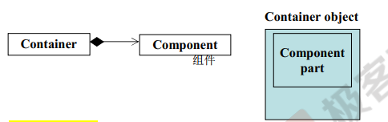


1. 复合构造函数之间的关系：

* 构造由内而外：Container 的构造函数首先调用Component 的**默认**构造函数，然后才执行自己；做一个东西，由内而外，这样基础才扎实，C++也要表现这种特性；如果编译器调用Component 的**默认**构造函数不符合你意的话，你就需要自己指明。

```c++
Container:::Container( ... ) : Component()   {  ...  }
// 外部的构造函数调用里边的构造函数，执行完之后，才执行外部的构造函数
// Component():是编译器帮我加上去的
```

* 析构由外而内：你有一个东西它有三层，你要析构它，当然是剥掉最外面的哪一层，在剥里面哪一层，你不能把最里边哪一层抽掉，你要抽掉整个就塌了；Container 的析构函数首先执行自己，然后才调用Component的析构函数

```c++
Container::～Container( ... )  {  ...～Component()  }
```


## 2 委托 - composition by reference

1. 委托

* String类中有一个 StringRep对象指针，表示String类中仍然有一个StringRep，但是这个 **有** 有点虚，不是那么扎实，只有一个指针指向它，至于String什么时候真的拥有StringRep，目前还不知道。
* 我拥有这个指针指向你之后，在任何一个我想要的时间点，我都可以调用你，来做事情，把任务委托给你

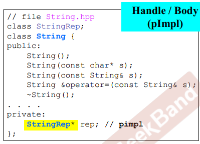

2. 委托关系图：String类中有一个 StringRep对象指针（委托关系图：空心的菱形）


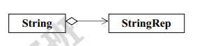

3. StringRep类

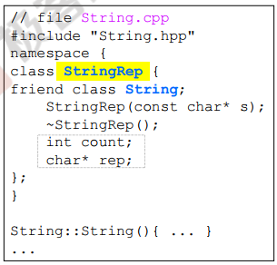

4. 复合关系与委托关系

* 复合关系是，如果有一个外部的，就有了内部的，生命是一起出现，一起消亡的，是同步的。
* 委托，String类先创建出来，等到需要StringRep的时候再去创建，不同步。

5. Handle / Body（pimpl）

* String字符串本身该怎么设计，我不在String类内写出来，该怎么设计在StringRep中写出来，String 类只是对外的接口，至于真正的实现，我在StringRep 里边做，当String需要动作的时候，都调用StringRep 类的函数来服务。这种写法叫做 pointer to  Implement（pimpl）


6. pimpl为什么这么有名？

* 如果我们把所有的类都写这样的话，String类对外不变，StringRep类是真正的实现，我们可以对外切换，String类这个指针将来可以指向不同的实现类，这就具有弹性，StringRep类不管怎么变动，都不影响String类，也就不影响客户端。

7. 引用计数，有三个字符串都在用一个Hello， a 、b、 c 共享一个Hello，n = 3 ；共享的前提内容要一样。


## 3 继承 Inheritance

1. public 继承表示的是 is-a的关系：是一种的关系；门 - 纲 - 目 - 科 - 属 - 种

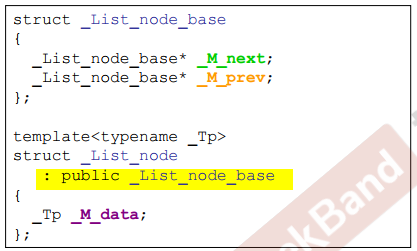

* 继承关系UML 类图，子类往父类画一个空心三角形

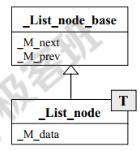


2. 三种继承方式：public、private、protected

3. 继承的内存关系

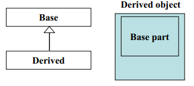

4. 继承关系的构造、析构函数

* 构造由内而外；Derived的构造函数首先调用Base的default构造函数，然后才执行自己 

```
Derived::Derived(...) : Base() { ... }
```

* **析构有外而内**：Derived的析构函数首先执行自己，然后调用Base的析构函数

```
Derived::~Derived(...) :  { ...Base() }
```

* Base class 的析构函数必须是virtual，否则出现undefined behavior

## 4 继承+复合下的构造和析构

1. 继承 + 复合 子类中既有Base，又有Component

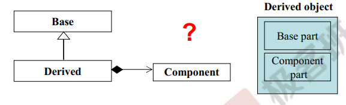

* 构造由内而外：子类的构造函数首先调用Base的default的构造函数，然后调用Component的默认构造函数，然后才执行自己
* 析构函数：子类的构造函数首先执行自己，然后调用Component的析构函数，然后调用Base的析构函数

2. 继承 + 复合 子类中有Base，Base中有Component


* 构造函数：先Component构造，在Base，最后子类
* 析构函数：先子类，在Base，最后Component析构


## 5 继承 + 委托

### 5.1 Observer 观察者模式

1. 观察者模式：基于同一组数据，生成了很多不同的界面来显示，有曲线图显示方式，有圆饼图显示方式，有柱状图显示方式等等…，当底层数据发生改变时，所有基于同一组数据的图像显示都需要修改图像，那么此时有两种实现方式：
2. 所有图形界面模块都去观察底层数据是否做了改变，如果变化，那么读取数据，修改图像显示
3. 此时有一个类似Observer观察者的模块，专门用来观察数据的变化，对某组数据感兴趣的图形界面模块，事先可以向Observer观察者注册，它对哪些数据的变化感兴趣，那么当Observer观察者观测到数据真的发生变化，它会及时的通知对这组数据变化感兴趣的图形界面模块执行相应的代码操作。

4. 代码

```c++
class Subject   // 存储数据
{
	int m_value;
    vector<Observer*> m_views;     // 存储窗口
public:
    void attach(Observer * obs)    // 注册一个窗口
    {   m_views.push_back(obs);  }
    
    void set_val(int value)
    {   m_value = value;
    	notify();
    }
    
    void notify() // 通知所有的窗口更新数据                
    {  
        for(int i = 0; i < m_views.size(); ++i) 
            m_views[i]->update(this, m_value);
    }
}

class Observer  // 显示窗口
{
    public:
    virtual void update(Subject* sub, int value) = 0;
}
```

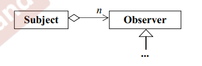

5. 解决的问题

* 文件只有一份，而窗口有3个，如果数据有变化，条状图，饼状图都要跟着变换；存储文件的class与表现文件的class两种，需要具备怎样的关联性呢？


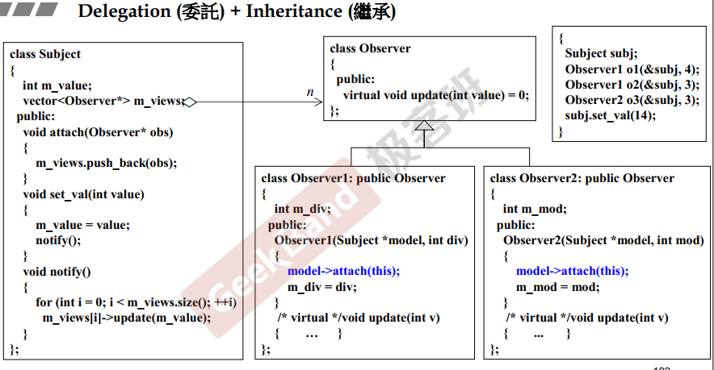


### 5.2 Composite 组合模式

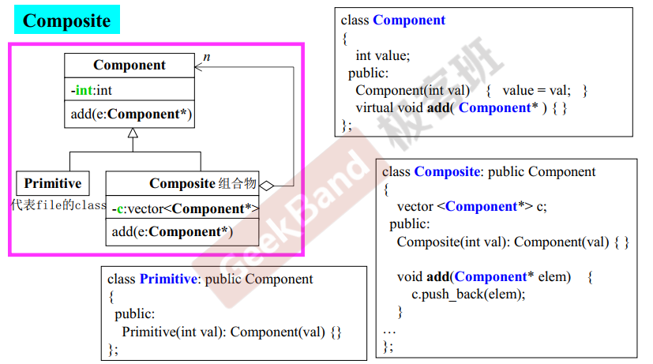

1. 假如要写一个文件系统，目录里边可以放文件，目录里边还可以放目录，目录里边有可以放文件、目录，要解决这种问题，classes应该如何设计？

* Composite可以容纳很多个Primitive，Composite还要容纳很多个Composite，该如何解决？
* 给Composite与Primitive写一个父类Component，Composite is a Component，Primitive is a Component。这个事情就好办了。Composite类中vector这个容器放Component这个东西，而且放的是指针。
* Composite应该具备一个函数add，加这个动作既要可以加Primitive这个东西，又要可以加Composite这个东西。怎么办？我们让他的参数是一个Component的指针，那么传进来的可能是Primitive这类指针，也可能是Composite这类指针；Composite除了add方法以外，还需要哪些方法呢？ 
* 需要注意 Component类，add函数不能是纯虚函数。

### 5.3 Prototype

1. 我现在要去创建未来的classes对象，你们后面发生的子类，你们自己去创建一个出来，反正只要你创建出来的对象是能被我 Image 看得到的，我就可以拿到它，当作一个蓝本，copy很多份
2. class LandSatImage 中有一个静态对象 LSAT，类型为LandSatImage ；私有构造函数LandSatImage()，作用是调用addPrototype(this) 把自己挂到 class Image 中，Image::addPrototype函数把得到的指针放到prototypes[10] 中去
3. LandSatImage::clone()  就是new自己，框架端 class Image通过挂上去的对象原型，调用clone函数，做出副本出来
4. 每个子类，自己有一个自己的个体，并且有一个构造函数，把自己的个体挂到class Image中去，然后每个子类clone()，让框架端根据挂上去的个体原型，调用clone()，创建副本出来。
5. class LandSatImage 调用clone函数new自己的，调用#LandSatImage(int) 构造函数（#表示保护区域）构造对象的。

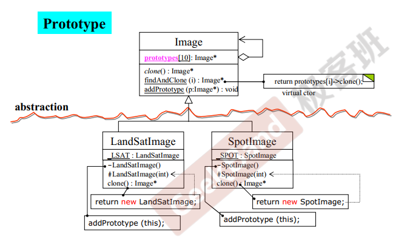


