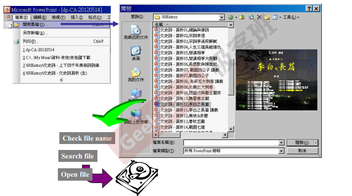
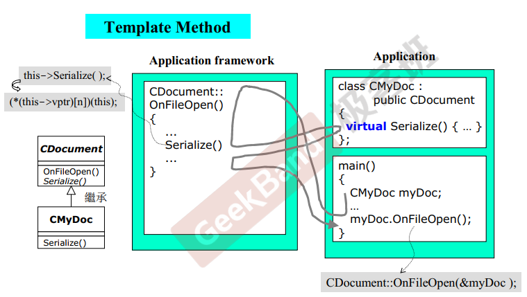
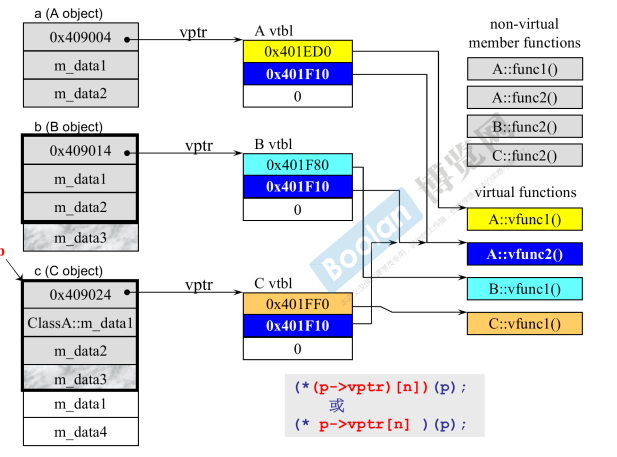
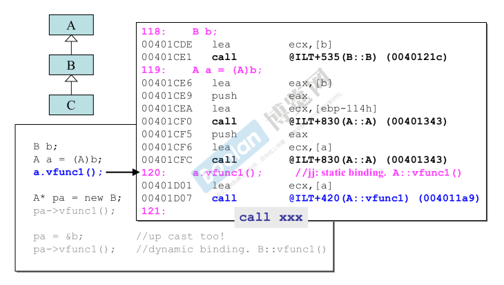
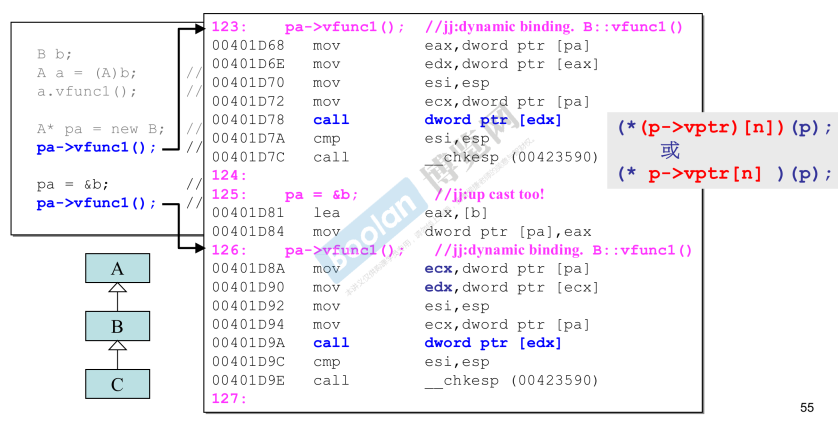

# 虚函数与多态

## 1 虚函数与纯虚函数

### 1.1 虚函数与纯虚函数

1. 虚函数与纯虚函数

* no-virtual函数：你不希望子类重新定义（override）它

* virtual函数：你希望子类重新定义它，且你对它已有默认定义

* 纯虚函数：你希望子类一定要重新定义它（override 覆盖），你对它没有默认定义

```c++
class Shape
{
public:
	virtual void draw() const = 0; // 纯虚函数 
     // 虚函数 运作过程中失败情况，默认的错误信息，子类可以重新定义错误信息
    virtual void error(const std::string& msg); 
    int objectID() const; // no-virtual函数 形状ID
    ....
}
class Rectangle : public Shape { ... };
```

2. 在继承的关系中，所有的东西都可以被继承下来，数据可以被继承下来，占用内存的一部分，函数也可以被继承下来，可是函数的继承不应该从内存的角度去理解，函数的继承，继承的是调用权，子类可以调用父类的函数，虚函数被重新定义，才能被叫 override

### 1.2 关键字：override

1. 指定一个[虚函数](https://zh.cppreference.com/w/cpp/language/virtual)覆盖另一个虚函数。

2. 在成员函数声明或定义中，override确保该函数为虚函数并覆盖某个基类中的虚函数。若此非真则程序编译错误。所谓override，函数签名必须完全相同。若本意是要override，但写错了，导致违背原本意图，比如下面这样：

```c++
struct A
{
    virtual void foo();
    virtual void vfunc(float) { }
    void bar();
};

struct B : A
{
    void foo() const override;       // Error：B::foo 不覆盖 A::foo （签名不匹配）
    void vfunc(int) override {  }    // Error 签名不匹配
    void foo() override;             // OK：B::foo 覆盖 A::foo
    void bar() override;             // Error：A::bar 非虚
};
// override的意思是告诉编译器去检查这个类的父类（或父类的父类等）是否有一个具有相同函数签名的virtual函数，如果没有，则编译器会报错。
```

### 1.3 final

1. 指定某个虚函数不能在子类中被覆盖  

```c++
struct Base
{
    virtual void f() final;
};
struct Derived : Base
{
    void f();
}
// Error: overriding final function 'virtual void Base::f()'
```

2. 某个类不能被子类继承

```c++
struct Base1 final { };
struct Derived1 : Base { };
// Error: cannot derive from 'final' base 'Base1' in derived type 'Derived1'
```


## 2 虚继承



1. 使用PowerPoint打开一个文件过程

* 开启文档 --> 档案名称 --> check file name --> Search file --> open file --> 硬盘读取文件
* 开启文档 -至- open file 之间所有的动作都是一样的，只有硬盘读取文件这个动作可能不同
* 既然开启文档 -至-  open file 之间所有的动作都是一样的，任何人写这段代码都差不多，表现出来的形式也都差不多，那能不能有人事先把它写好呢？让以后的人来直接用呢？



* CDocument::OnFileOpen()  把开启文档  -至-  open file 之间所有的动作全部写好，只有硬盘读取文件这个动作写不出来，父类有一些动作写不出来，要让子类去写它，这一种必须要设计成virtual function。
* CMyDoc继承CDocument，必须要实现Serializer()，myDoc.OnFileOpen() 通过子类对象调用父类函数

* 父类CDocument把一个关键动作Serializer()，延缓到子类去实现，父类CDocument::OnFileOpen()这个函数的做法，我们叫做Template Method（23种设计模式之一）

* Application framework 应用程序框架，MFC的实现原理。

* myDoc.OnFileOpen(&myDoc)  ---> 执行Serializer()动作时，满足指针调用（this->Serializer() this就是&myDoc）、向上类型转换、虚函数这三个条件，所以动态绑定，调用class CMyDoc的Serializer()

2. CDocument 模拟程序

```c++
class CDocument {
public:
    void OnFileOpen() {
        cout << "dialog ... " << endl; 
        cout << "check file status ... " << endl; 
        cout << "open file ... " << endl; 
        Serializer();
        cout << "close file ... " << endl; 
        cout << "update all Views ... " << endl; 
    }
    virtual void Serializer() { }; // 空函数
}

class CMyDoc : class CDocument {
public:
    virtual void Serializer() {
        cout << "CMyDoc::Serializer()" << endl; // 只有应用程序才知道如何读取自己的文件
    }
}
// 调用
CMyDoc myDoc;
myDoc.OnFileOpen();
```


## 3 对象模型关于vptr和vtbl

1. 只要你的类里边有一个虚函数，这个对象里边就会多一个虚指针
2. 虚表放的是虚函数指针，指向虚函数

```c++
class A
{
public:
    virtual void vfunc1();
    virtual void vfunc2();
    void vfunc1();
    void vfunc2();
private:
    int m_data1, m_data2;  
}

class B : class A
{
public:
    virtual void vfunc1();  // override
    void vfunc2();
private:
    int m_data3;  
}

class C : class B
{
public:
    virtual void vfunc1();  // override
    void vfunc2();
private:
    int m_data1, m_data4;
}
```




3. 静态绑定与动态绑定

* 静态绑定：type p = new C; 通过指针p，调用C::vfunc2() ，编译器看到一个调用的动作，在C语言中，一定是把它编译成一个特定的语法，call xxx，你要调用哪个函数，编译器就把它解析出来，跳到那个地方去，将来再return回来
* 如果调用的是虚函数的话，一定不能做静态绑定，面向对象设计的关键点。通过p这个指针，找到虚指针，通过虚指针，找到虚表，然后再从虚表中，找到调用的哪个函数；(*(p->vptr) [n]) (p);  p就是this

4. C++ 编译器看到一个函数调用，它有两个考量，要把它静态绑定、还是要动态绑定，静态绑定要把它编译成什么样子呢？ call xxx（xxx就是一个地址）；如果符合某些条件就动态绑定，第一：必须是通过指针来调用，第二：这个指针是向上转型（ 想实现“动态绑定”，必须有继承、重写且父类引用指向子类对象 ），保证安全；第三：调用的是虚函数，只要符合这三个条件，就动态绑定 (*(p->vptr) [n]) (p); 


## 4 静态绑定与动态绑定

1. 静态绑定



2. 动态绑定

