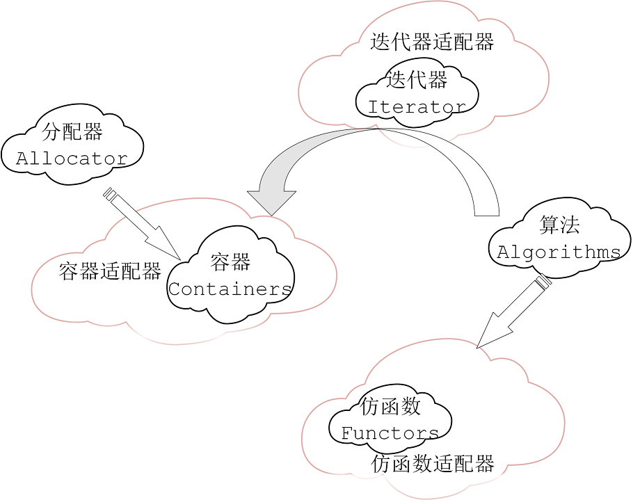

# 泛型编程与面向对象

1. 整个C++标准库，并不是用面向对象的概念设计出来的，而是根据泛型编程的思路做出来的。
2. 面向对象是class与class之间关系，还有一些继承关系，虚函数。

## 1 OOP是将datas和methods合在一起

1. 继承，动态绑定与数据抽象（也就是封装、继承、多态）一起成为了面向对象编程的基础 

* 用类进行数据抽象——抽象和封装
* 用类派生从一个类继承另一个类：派生类继承基类的成员——代码复用
* 关键思想：多态，动态绑定能够在运行时决定调用的是基类定义的函数还是子类定义的函数——接口复用

2. 为什么list不能使用::sort()排序？

* list链表是一个个结点用指针串起来的。标准库sort这个算法，所用的迭代器需要一定的条件，而这个条件是标准库list容器的迭代器所不能满足的。list不像vector与deque使用全局sort排序。
* 如果有一些容器，自己带着sort的话，就必须使用容器自己带到sort排序

```c++
template<class T, class Alloc=alloc>
class list
{   ...
    void sort();
}
```

## 2 GP却是将datas和methods分开来

1. 泛型编程，即独立于任何特定类型的方式编写代码，其基础是**模版**，其实现是依赖于某种形式的多态性，面向对象的编程依赖的多态称为运行时多态，而泛型编程依赖的是编译时多态。

2. Containers和Algorithms团队可各种闭门造车，其间以Iterator沟通即可。



* A 与B比大小，由A与B这种东西去定，比如两个石头比大小，这不是算法min/max所关心的事情，石头怎么比大小由石头去定，也就是说，石头这个class需要重载operator< 或者operator> 这个操作符，因为这样一个思路，所以在标准库中操作符重载非常重要。

```c++
template<class T>
inline const T& min(const T&a, const T& b)
{
    return b < a ? b : a;
}
```


3. Algorithms通过Iterators确定操作范围，并通过Iterators取用Container中的元素

4. 所有Algorithms，其内最终涉及元素本身的操作，无非就是比大小。找一个东西比等不等，不小于不大于就是等于，排序也是比大小后挪动元素的位置

