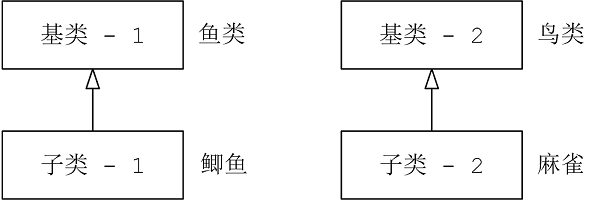

# C++模板

## 1 泛型编程与面向对象

## 2 函数模板

1. 函数模板不能缩短可执行程序，使用模板的好处是：它使生成多个函数定义更简单、更可靠。

### 2.1 重载的模板

1. 和常规重载一样，被重载的模板的函数特征标必须不同。注意：并非所有的模板参数都必须是模板参数类型。

```c++
template <typename T>
void swap(T &a, T &b);

template <typename T>
void swap(T &a, T &b, int n); // 交换两个数组 void swap(T a[], T b[], int n); 
```

### 2.2 模板的局限性

1. 模板通用化是由意义的，但有时编写的模板函数很可能无法处理某些类型。比如 a + b; 如果a与b为int，模板函数可以处理，但两位置坐标点相加，模板函数很可能就无法处理。
2. 解决办法

* 重载运算符+。以便能够将其用于特定的结构或类
* 为特定的类型提供具体化的模板定义

### 2.3 具体化

1. 对于给定的函数名，可以有非模板函数、模板函数和显式具体化模板函数以及它们的重载版本

```c++
void swap(job &a, job &b); // 非模板函数

template <typename T>      //模板函数
void swap(T &a, T &b);

template <>                // 显式具体化模板函数
void swap<job>(job &a, job &b); // 等价于：void swap<>(job &a, job &b); 
```

2. 显示具体化的原型和定义应以**template <>** 打头，并通过名称指定类型
3. 非模板版本优先于显示具体化和模板版本，显示具体化优先于使用模板生成的版本；
4. 显示具体化：也就是模板特化

```c++
template <> void swap<int>(int &, int &);
template <> void swap<>(int &, int &);
```

### 2.4 实例化

1. 代码中包含函数模板本身并不会生成函数定义。编译器使用模板为特定类型生成函数定义时，得到的是**模板实例**

2. 隐式实例化：swap(i, j); 导致编译器生成swap() 的一个实例，该实例使用int类型；模板并非函数定义，但使用int的**模板实例**是函数定义

```c++
int i = 10, i = 20;
swap(i, j);
```

3. 显示实例化：使用命令，编译器创建特定的实例， 也就是生成函数定义

```c++
template void swap<int>(int, int);//使用swap模板生成int类型的函数定义
```

## 3 成员模板

1. Pair 例子

```c++
template<class T1,class T2>
struct Pair {
public:
    T1 first;
    T2 second; //普通构造
    Pair() :first(T1()), second(T2()) {}
    Pair(const T1& a,const T2& b) : first(a),second(b) {}
    //成员模板
    template<class U1,class U2>
    Pair(const Pair<U1, U2>& p) : first(p.first),second(p.second) {}
    // const Pair<U1, U2>& p 初值p的头、尾放进来当作我本身的头、尾
    // 鲫鱼是一种鱼类，麻雀也是一种鸟类
};

class Base1 {};  //Base1理解为鱼类
class derived1 :public Base1 {}; //derived1理解为鲫鱼

class Base2 {};  //Base2理解为鸟类
class derived2 :public Base2 {}; //derived2理解为麻雀
```



```c++
Pair<derived1, derived2> p;
Pair<Base1, Base2> p2(p);
相当于：Pair<Base1, Base2> p2(Pair<derived1, derived2>());
把一个由鲫鱼和麻雀组成的Pair，放进（拷贝到）一个由鱼类和鸟类构成的Pair中，可以吗？反之可以吗？
```

2. 智能指针 shared_ptr

```c++
template <typename _Tp>
class shared_ptr : public __shared_ptr<_Tp>
{
    template<typename _Tp1>
    explicit shared_ptr(_Tp1 * __p) : __shared_ptr<_Tp>(__p) {} // 
}

有一个智能指针指向鱼类，现在又给它设初值，给它的指针指向鲫鱼类，可以吗？
Base * ptr = new Derived; //up-cast
shared_ptr<Base> sptr(new Derived);
//普通指针支持向上类型转换，那智能指针也必须支持，就要写出上面的成员模板
```

3. 模板类将另一个模板类和模板函数作为其成员

```c++
template<typename T>
class beta {
private:
	template <typename V>
	class hold {  // 内嵌模板类成员
	private:
		V val;
	public:
		hold(V v = 0) : val(v) {}
		void show() const { cout << val << endl; }
		V value() const { return val; }
	};
	hold<T> q;
	hold<int> n;
public:
	beta(T t, int i) :q(t), n(i) {}
	template<typename U>     // 模板函数
	U blab(U u, T t) { return (n.value() + q.value())*u / t; }
	void Show() const { q.show(); n.show(); }
};
```


## 4 类模板

### 4.1 定义类模板

1. 如何定义类模板

* 使用模板定义替换Stack声明

```c++
template<class Type>
```

* 使用模板成员函数替换Stack的成员函数

```c++
1 使用泛型名Type替换typedef标识符Item
2 换需要将类限定符从Stack:: 改为myStack<Type>::
bool Stack::push(const Item & item)
{ .... }
替换为：
template<class Type>
bool myStack<Type>::push(const Type & item)
{ .... }
```

2. 注意点

* 模板必须与特定的模板实例化请求一起使用,不能将模板成员函数放在独立的实现文件中
* 类模板函数限定符写法 myStack<Type\>::

### 4.2 使用类模板

1. 类模板必须显示地提供所需的类型

2. 常规的函数模板，可以根据函数的参数类型来确定要生成那种函数
3. 例子中的函数

```c
C 库函数 int toupper(int c) 
1.函数功能：    
把小写字母转换为大写字母。
2.头文件
#include <cctype>
3.参数
c -- 这是要被转换为大写的字母。
```

```c
int isalpha ( int c );
头文件：<ctype.h>
函数功能： 函数用来检测一个字符是否是字母。
```

### 4.3 模板实例化与具体化

1. 隐式实例化：声明一个或者多个对象，指出所需的类型，编译器使用通用模板提供的处方生成具体的类定义
2. 显式实例化：声明类时，使用关键字template并指出所需类型，编译器将生成类声明的显式实例化。声明必须位于模板定义所在的名称空间中。

```c++
template class ArrayTP<string, 100>
```

3. 显式具体化：也就是模板特化，模板特化生成的是模板

```c++
template<>
class SortedArray<const char *>
{ }
```

4. 部分具体化：也就是模板偏特化

```c++
template<typename T1, typename T2>  // 通用模板 - 泛化
class Pair
{ .... }

template<typename T1>  // 偏特化
class Pair<T1, int>
{ .... }
```

5. 参考 1- 5- 4 模板其他功能：模板泛化、特化与偏特化