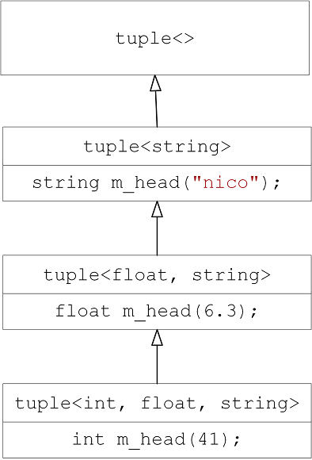
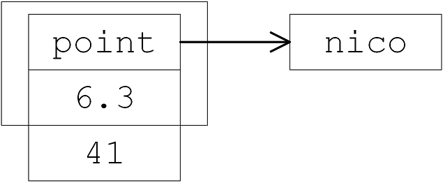
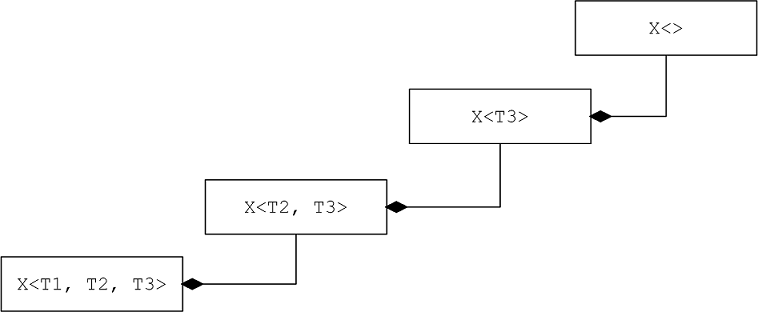

# 模板其他功能

## 1 模板多功能性

### 1.1 递归使用模板

```c++
ArrayTP<ArrayTP<int, 5>, 10> twodee;
twodee 是一个包含10个元素的数组，其中每个元素都是一个包含5个int元素的数组。等价于 int twodee[10][5];
```

### 1.2 使用多个类型参数

1. 模板包含多个类型参数 --  **联系成员函数模板例子**

```c++
template<class T1, class T2>
class Pair {
private:
	T1 a;
	T2 b;
public:
	T1 & first();
	T2 & second();
	T1 first() const { return a; }
	T2 second() const { return b; }
	Pair(const T1 & aval, const T2 & bval) : a(aval), b(bval) {}
	Pair() {}
};

template<class T1, class T2>
T1 & Pair<T1, T2>::first()  
{ return a; }  // 重新设置pair的值

template<class T1, class T2>
T2 & Pair<T1, T2>::second()
{ return b;}

int main() {
	Pair<string, int> pair("The PurPle Duck", 5);
	pair.first() = "xixihaha123"; // 调用 T1 & Pair<T1, T2>::first()
	pair.second() = 5;
	cout << pair.first() << " :\t" << pair.second() << endl;
}
```


### 1.3 默认类型模板参数

1. 类模板类型参数提供默认值，不能为函数模板参数提供默认值
2. 类模板、函数模板，都可以都可以为非类型参数提供默认值

## 2 模板泛化、特化与偏特化

1. 泛化：所有模板参数类型都未定义，等到使用时才知道，通用的模板 

```c++
template <class Key>
struct hash {  };
```

2. 模板的特化：给模板中的所有模板参数指定具体的类型

```c++
template <>        // Key被绑定，所以就没有了，不可见了，所以template <>
struct hash<char>  // 注意语法 struct hash<char>
{
    size_t operator() (char x) const { return x; }
}

template <>
struct hash<long>
{
    size_t operator() (long x) const { return x; }
}
// 指定任意的类型就会到template <class Key>来
// 但如果你指定的是long，就会使用 struct hash<long> 这个版本
cout << hash<long>() (1000);
```

3.  模板的偏特化： 给模板中的部分模板参数指定具体的类型，而留下剩余的模板参数仍然使用原来的泛化定义的方式来实现的。 

* 模板的偏特化分为：模板参数个数上的偏、范围上的偏

```c++
// 模板参数个数上的偏
template<typename T, typename Alloc=....>
class vector
{ ... }

template<typename Alloc=....>
class vector<bool, Alloc>  // T 绑定bool
{ ... }
```

```c++
// 模板参数范围上的偏
template <typename T>  
class C                 // 模板参数为任意类型
{ ... }

template <typename T>
class C<T*>             // 任意类型指定为指针类型
{ ... }
// 使用
C<string> obj1;
C<string*> obj2;
```

## 3 模板模板参数

1. 实际上有三种类型模板参数：类型模板参数、模板模板参数(以模板作为模板的参数)、无类型模板参数。 
2. 像Container 容器类拥有多于1个的模板参数。要实现Container 作为Crab的第二个模板，那么需要指明Container 的两个模板参数

```c++
template<typename T, template <typename T> class Container>
class Crab
{
private:
    Container<T> c;  // list<string> 
public:
    ......
}
/**********************************************/
template<typename T>
using Lst = list<T, allocator<T>>;
Crab<string, Lst> mylist;  // ok

Crab<string, list> mylist; // Error容器有第二、第三模板，虽然有默认值，但这样写编译过不了
```

3. **模板模板参数，还需要和另一种形式区分开：** 

```c++
template<class T, class Sequence = deque<T>> //这种不是模板的模板参数
class stack
{
protected:
    Sequence c; // 底层容器
}

stack<int> s1;
stack<int, list<int>> s2;
```

Sequence的默认值deque<T\>实际上已经指明了Sequence的类型是deque，只是因为deque还有一个模板参数而已。

它和上面讲的不一样，上面讲的 template<typename T\> class Container，相当于Sequence<T\>，Sequence和T都是待指定的模板参数。所以还是有本质区别的。

## 4 模板别名

1. C++11 - 使用模板提供的一系列别名

```c++
typedef std::array<int, 12> arri;
typedef std::array<std::string, 12> arrst;
定义： 
arri days;     // days is type std::array<int, 12>
arrst months;  // months is type std::array<std::string, 12>
```

* 等价于

```c++
template<typename T>
using arrtype = std::array<T, 12>;
arrtype<int> days;              // days is type std::array<int, 12>
arrtype<std::string> months;    // months is type std::array<std::string, 12>
```

## 5 可变模板参数 variadic Templates

### 5.1  variadic Templates

1.   ... 就是一个所谓的pack(包)，用于模板参数,就是模板参数包； 用于函数参数类型,就是函数参数类型包；用于函数参数,就是函数参数包；
2. 谈的是template – 函数模板、类模板

3. 变化的是模板参数：参数个数、参数类型

* 参数个数：利用参数个数逐一递减的特性,实现递归函数调用,使用函数模板完成

* 参数类型：利用个数逐一递减导致参数类型也逐一递减的特性，实现递归继承或递归复合，以类模板完成

```c++
void print()  // 处理边界条件;无此函数 编译出错
{
	//剩余0个参数 - 处理临界条件 
    cout << "边界条件" << endl;
}

template<typename T, typename... Types>             // 模板参数包，参数的类型任意的
void print(const T& firstArg, const Types&... args) // 函数参数包，接收任意个数的参数
{
	cout << firstArg << endl;  // sizeof...(args)
	print(args...); // 将n个参数分解为1+(n-1), 1+(n-2)  可用递归 
}

int main() {
	print(7.5, "Hello", bitset<16>(255), 42);
	return 0;
}
```

2. 下面两个函数模板,能不能并存，若可以，谁较泛化？谁较特化？

```c++
template<typename T, typename... Types>
void print(const T& firstArg, const Types&... args)
{ … }

template<typename... Types>
void print(const Types&... args)
{ … }
// 调用
printX(7.3, "hello", bitset<16>(377), 42);
可以并存,模板,有特化这个概念,谁更特化/特别,就调用谁?
printX(const Types&... args)                         // 4
printX(const T& firstArg, const Types&... args)      // 1 + 3
1 + 3 比较特化,上边两个模板函数并存时,调用 1 + 3
```

3. 注意

```c++
// 无限递归调用，死循环
template<typename... Types>
void show_list(const Types&... args) 
{
	show_list(args...);
}
```

### 5.2 可变参数模板重写printf  

1. 重写printf()

```c++
// 调用
my_printf("%d %s %p %f\n", 15, "This is Ace", pi, 3.1456767);
// 函数
void my_printf(const char* s) {
	cout << "边界条件" << endl;
	while (*s) {
		if (*s == '%' && *(++s) != '%')
		throw std::logic_error("invalid format string:missing arguments");
		std::cout << *s++;
	}
}

template<typename T,typename... Args>
void my_printf(const char* s, T value, Args... args) {
	while (*s) {
		if (*s == '%' && *(++s) != '%') {
			std::cout << value;
			my_printf(++s, args...);
			return;
		}
		std::cout << *s++;
	}
	throw std::logic_error("extra arguments provided to printf");
}

```

### 5.3 max检测一堆数据中最大的一个 - initializer_list实现

1. 参数类型一致,参数个数不限,可以使用 **initializer_list** 足矣

```c++
struct _Iter_less
{
	template<typename _Iterator1, typename _Iterator2>
	bool operator()(_Iterator1 _it1, _Iterator2 _it2) const  // 仿函数
	{
		return *_it1 < *_it2;
	}
};

inline _Iter_less _iter_less()
{
	return _Iter_less(); // type产生临时对象
}


template<typename _ForwardIte>
inline _ForwardIte my_max_element(_ForwardIte _first, _ForwardIte _last)
{
	return my_max_element(_first, _last, _iter_less()); // 调用 _iter_less()函数
}

template<typename _ForwardIte, typename _Comp>
_ForwardIte my_max_element(_ForwardIte _first, _ForwardIte _last, _Comp _comp)
{
	if (_first == _last) return _first;
	_ForwardIte result = _first;
	while (++_first != _last)
	{
		if (_comp(result, _first))
			result = _first;
	}
	return result;
}

template<typename _Tp>
inline _Tp my_max(initializer_list<_Tp> _list)
{
	return *my_max_element(_list.begin(), _list.end());
}

cout << "最大数 = " << my_max<int>({2, 5, 3, 8, 12, 6})  << endl;
```


### 5.4 max检测一堆数据中最大的一个 - 可变参数模板实现

1. 若参数type皆同,可利用可变参数模板  

```c++
int maximum(int n) {
	return n;
}

template<typename... Args>
int maximum(int n, Args... args) {
	return std::max(n, maximum(args...)); // 利用不断调用标准库std::max()完成最大值获取
}

/************************调用*****************************/
cout << maximum(2, 5, 3, 8, 12, 6) << endl;
```

### 5.5 tuple原理 - 递归创建

1. 以异于一般方式处理first元素和last元素  

```c++
template<int IDX, int MAX, typename... Args>
struct print_tuple
{
	static void print(ostream& os, const tuple<Args...>& t)
	{
		os << get<IDX>(t) << (IDX + 1 == MAX ? "" : ",");
        // tuple的成员get<Ith>(obj)进行获取(Ith是指获取在tuple中的第几个元素
		print_tuple<IDX + 1, MAX, Args...>::print(os, t); // 递归创建
	}
};

template<int MAX, typename... Args>
struct print_tuple<MAX, MAX, Args...>  // IDX + 1 = MAX
{
	static void print(std::ostream& os, const tuple<Args...>& t)
	{}
};

template<typename... Args>
ostream& operator<<(ostream& os, const tuple<Args...>& t) {
	os << "[";
	print_tuple<0, sizeof...(Args), Args...>::print(os, t);
	return os << "]" << endl;
}

int main()
{
	// tuple 任意元素组合成一包
    cout << make_tuple(7.5, string("hello"), bitset<16>(377), 42);
	return 0;
}
```

2. 执行结果


### 5.6 tuple原理 - 递归继承

1. tuple 任意元素组合成一包

```c++
template<typename... Values> class my_tuple;
template<> class my_tuple<> {};

template<typename Head, typename... Tail>
class my_tuple<Head, Tail...> : private my_tuple<Tail...> // private继承
{              // 第一个创建对象Head m_head;  n - 1个继承下去
	typedef my_tuple<Tail...> inherited;
public:
	my_tuple() {}
	my_tuple(Head v, Tail... vtail)
		: m_head(v), inherited(vtail...)  // 注意这个initialization list
	{}

	Head head() { return m_head; }
	inherited& tail() { return *this; }
protected:
	Head m_head;
};

int main()
{
	my_tuple<int, float, string> t(41, 6.3, "nico");
	cout << sizeof(t) << endl;
	cout << t.head() << endl;
	return 0;
}
```

2. tuple原理分析 - 类图




* 元素内存结构图




### 5.7 tuple原理 - 递归复合

1. tuple – 可变参数模板复合实现 

```c++
template<typename... Values> class my_tuple;
template<> class my_tuple<> {};

template<typename Head, typename... Tail>
class my_tuple<Head, Tail...>
{
	typedef my_tuple<Tail...> composited;
protected:
	Head m_head;
	composited m_tail;
	
public:
	my_tuple() {}
	my_tuple(Head v, Tail... vtail)
		: m_head(v), m_tail(vtail...)
	{}

	Head head() { return m_head; }
	composited& tail() { return m_tail; } // 注意返回类型是reference
};
// 调用
my_tuple<int, float, string> t(41, 6.3, "nico");
cout << t.head() << endl;
```

2. 类图




### 5.8 C++11模板细节改进

1. The requirement to put a space between two closing template expressions has gone（不再对两个模板表达式之间的空格做要求）

```c++
vector<list<int> >;     // OK in each C++ version
vector<list<int>>;      // OK since C++11
```

### 5.9 化名模板

1. using ( 不能对Alias Template 进行偏特化或特化 )

```c++
// standard vector using own allocator
template <typename T>
using Vec = std::vector<T, MyAlloc<T>>;

Vec<int> coll; 就相当于 std::vector<int, MyAlloc<int>> coll;    
// 不能对Alias Template 进行偏特化或特化
```

2. 使用 define 和typedef都无法达到与using相同的效果

```c++
#define Vec<T> template<typename T> std::vector<T, MyAlloc<T>>
Vec<int> coll;
template<typename int> std::vector<int, MyAlloc<int>>;             // 这不是我想要的

使用typedef亦无法达到相同效果,因为typedef是不接受参数的，我们至少写成这样
typedef std::vector<int, MyAlloc<int>> Vec;                        // 这不是我想要的
```

3.  测试程序验证 --- 容器是否具有移动构造函数/移动赋值函数，测试函数需要传递 --- 容器类型与容器中存储数据的类型 

```c++
/********************天方夜谭 - 1****************************/
void test_moveable(Container cntr, T elem) // 容器类型与容器中存储数据的类型 
{
Container<T> c;
    for(long i = 0; i < SIZE; ++i)
        c.insert(c.end(), T());
    output_static_data(T());
    Container<T> c1(c);
    Container<T> c2(std::move(c));
    c1.swap(c2);
}
// 调用
test_moveable(list, MyString);             // 函数参数一定是一个object
test_moveable(list, MyStrNoMove);
```


```c++
/********************天方夜谭 - 2****************************/
template<typename Container, typename T>
void test_moveable(Container cntr, T elem) // 函数模板做实参推导
{
typename Container<T> c;
    for(long i = 0; i < SIZE; ++i)
        c.insert(c.end(), T());
    output_static_data(T());
    Container<T> c1(c);
    Container<T> c2(std::move(c));
    c1.swap(c2);
}

test_moveable(list<MyString>(), MyString()); // Container is not a template
test_moveable(list<MyStrNoMove>(), MyStrNoMove());
```

4. 采用：function template + iterator ＋ traits

```c++
template<typename Container>
void test_moveable(Container c)
{
	// 注意此处 typename 的使用
    typedef typename iterator_traits<typename Container::iterator>::value_type Valtype;
	for (long i = 0; i < SIZE; ++i)
		c.insert(c.end(), Valtype());
	Container c1(c);
	Container c2(std::move(c));
	c1.swap(c2);
}

int main()
{
	test_moveable(list<int>());
	return 0;
}
// 有没有template语法能够在模板接收一个template参数Container时,当Container本身又是个class template,能取出Container的template参数? 例如收到一个vector<string>,能够取出其元素类型string?
// 另向思考：既然谈的是 Container，其iterator 就能够回答 value_type 这种问题，间接解决了上述提问。但在没有 iterator和traits的情况下呢？
```

5. 匿名对象＋模板 可获取参数的类型

```c++
// 匿名对象 + 函数模板可获取参数的类型
template<typename Container, typename T>
void test_moveable(Container cntr, T elem)
{
	cout << typeid(cntr).name();
}

int main()
{
	test_moveable(std::list<int>(), int());
}
// 执行结果
class std::list<int, class std::allocator<int>>  // 函数传参,只能传对象,无法传类型
```

6. 化名模板在模板模板参数的应用

```c++
template<typename T, template<class T> class Container>  // 模板模板参数
class XCLs
{
private:
	Container<T> c;
public:
	XCLs()
	{
        for (long i = 0; i < SIZE; ++i)
			c.insert(c.end(), T());
		Container<T> c1(c);
		Container<T> c2(std::move(c));
		c1.swap(c2);
	}
};

// 如果在一般的代码写vector 只需要第一模板参数，因为第二个有默认值，但是当你以模板模板参数传递进去的时候，编译器无法帮你推导出第二模板参数（第二模板参数以第一个参数为参数）
template<typename T>
using Vec = vector<T, allocator<T>>;       // 化名模板的应用

template<typename T>
using Lst = list<T, allocator<T>>;         // 化名模板的应用，只需要接收一个参数就够了

int main()
{	
	XCLs<int, Vec> c1;
	return 0;
}
```

