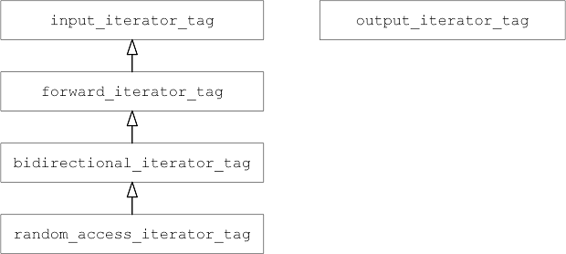
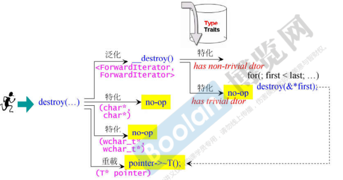

# 2 迭代器

## 2.1 各种容器的迭代器的iterator_category  

1. 各种容器的迭代器 

| Array                               | Random Access iterator                   |
| ----------------------------------- | ---------------------------------------- |
| Vector                              | Random Access iterator                   |
| Deque                               | Random Access iterator                   |
| list                                | Bidirectional iterator                   |
| Forword-list                        | Forward iterator                         |
| Set/Multiset                        | Bidirectional iterator                   |
| Map/Multimap                        | Bidirectional iterator                   |
| Unordered set/Multiset (hash_table) | Bidirectional iterator (vs2019执行结果） |
| Unordered Map/Multimap (hash_table) | Bidirectional iterator (vs2019执行结果） |

2. 容器提供的迭代器分类不是 1 , 2, 3, 4, 5,而是具有继承关系的class ?

```c++
// 移动能力的分类:
struct input_iterator_tag {};
struct output_iterator_tag {};
struct forward_iterator_tag : public input_iterator_tag {};
struct bidirectional_iterator_tag :public forward_iterator_tag {};
struct random_access_iterator_tag : public bidirectional_iterator_tag {};
```



3. 打印各容器的迭代器

```c++
void display_category(random_access_iterator_tag)
{ cout << "random_access_iterator" << endl; }

void display_category(bidirectional_iterator_tag)
{ cout << "bidirectional_iterator_tag" << endl; }
....
    
template<typename I>
void iterator_category(I itr)
{
	typename iterator_traits<I>::iterator_category cagy; // 萃取
	display_category(cagy);
    
    cout << "typeid(itr).name() = " << typeid(itr).name() << endl << endl;
}
// 调用
iterator_category(array<int,10>::iterator());
iterator_category(istream_iterator<int>());         // input_iterator
iterator_category(ostream_iterator<int>(cout, "")); // output_iterator
```

## 2.2 istream_iterator/ostream_iterator的iterator_category

```c++
// G2.9
template <class _Tp, class _Dist = ptrdiff_t> 
class istream_iterator {
public:
    typedef input_iterator_tag  iterator_category;
    .....
}

// G4.9
template<typename _Tp, typename _CharT = char,
         typename _Traits = char_traits<_CharT>, typename _Dist = ptrdiff_t>
class istream_iterator
    : public iterator<input_iterator_tag, _Tp, _Dist, const _Tp*, const _Tp&>
{ }

template<typename _Category, typename _Tp, typename _Distance = ptrdiff_t,
         typename _Pointer = _Tp*, typename _Reference = _Tp&>
struct iterator
{

    typedef _Category  iterator_category;
    typedef _Tp        value_type;
    typedef _Distance  difference_type;
    typedef _Pointer   pointer;
    typedef _Reference reference;
};
// istream_iterator的父类iterator，没有data，没有function，istream_iterator继承父类iterator等同于子类istream_iterator拥有了五个typedef
```


## 2.3 iterator_category对算法的影响

### 2.3.1 distance

1. distance 就是要知道两根指针之间的距离，distance接收两个参数，一个是first，一个是last，如果是连续空间，两根指针之间的距离 = last - first；迭代器的分类不用1，2，3，4，5，而是用具有继承关系对象表现；如果问出来的迭代器 category是farward_iterator_tag，代码中并没有为它而设计的专属版本，那它会调用到谁？虽然没有为farward_iterator设计专属版本，它是farward_iterator is a input_Iterator，所有调用input_Iterator的版本

```c++
template <class InputIterator>
inline iterator_traits<InputIterator>::difference_type
distance(InputIterator first, InputIterator last)
{
    typedef typename iterator_traits<InputIterator>::iterator_category category;
    return __distance(first, last, category()); // category() 创建一个临时对象
}
// 注意distance的返回值
```

3. 判断iterator是不是 random_access，如果是random_access，distance = last - first；

```c++
template <class RandomAccessIterator>
inline iterator_traits<RandomAccessIterator>::difference_type
__distance(RandomAccessIterator first, RandomAccessIterator last,random_access_iterator_tag)
{
    return last - first;
}
```

4. input_iterator，头跟尾的距离就不能直接相减，就只能从头走到尾，看一共走几步

```c++
template <class InputIterator>
inline iterator_traits<InputIterator>::difference_type
__distance(InputIterator first, InputIterator last, input_iterator_tag)
{
    iterator_traits<InputIterator>::difference_type n = 0;
    while (first != last) {
        ++first; ++n;
    }
    return n;
}
```


### 2.3.2 advance 

1. advance函数

```c++
template <class InputIterator, class Distance>
inline void advance(InputIterator& i, Distance n)
{
    __advance(i, n, iterator_category(i));
}
```

2. 此函数协助取出iterator的category并以此创建一个临时对象

```c++
template <class Iterator>
inline typename iterator_traits<Iterator>::iterator_category
iterator_category(const Iterator&) {
    typedef typename iterator_traits<Iterator>::iterator_category category;
    return category();
}
```

3. 迭代器类型为RandomAccessIterator，调用此函数

```c++
template <class RandomAccessIterator, class Distance>
inline void __advance(RandomAccessIterator& i, Distance n, 
 random_access_iterator_tag)
{
    i += n;
}
```

4. 迭代器类型为BidirectionalIterator，调用此函数

```c++
template <class BidirectionalIterator, class Distance>
inline void __advance(BidirectionalIterator& i, Distance n, 
bidirectional_iterator_tag)
{
    if (n >= 0)
        while (n--) ++i;
    else
        while (n++) --i;
}
```

5. 迭代器类型为InputIterator，调用此函数

```c++
template <class InputIterator, class Distance>
inline void advance(InputIterator& i, Distance n, input_iterator_tag)
{
    while (n--) ++i;
}

```

### 2.3.3 copy

1. copy里边在不断的做检查，检查它所收到的迭代器，是不是特别属于某一种类型，而决定要不要做一些很特别的动作来加快速度
2. copy无所不用其极侦查，期望找到效率最高的路线
3. STL源码剖析- p314

```c++
// copy(来源端头, 来源端尾, 目的端的头); 
template <class InputIterator, class OutputIterator>
OutputIterator copy(InputIterator first, InputIterator last, OutputIterator result)
{
    while(first != last)
    {
        *result = *first; // inserter
        ++result; ++first;
    }
    return result;
}
```

### 2.3.4 destroy

1. Type Traits判断你的析构函数是重要（has non-trivial dtor ）的吗？还是不重要（has trivial dtor）？如果是不要的，就no-op，不用做什么事情了；
2. type_traits 不属于STL的内容,属于标准库
3. 迭代器的分类对算法的有重要的影响



 

### 2.3.5 unique_copy

1. 重复的东西就不copy了，它只copy独一无二的元素


## 2.4 算法源码中对iterator_category 有没有强制限制呢? 

1. 算法源码中对iterator_category 有没有强制限制呢 ？没有，他只有暗示，因为算法是一个模板函数，模板的意思就是可以接收各式各样的类型，算法针对迭代器不同的类型，分成不同的次函数去做。

2. 算法主函数，没有任何强制指定接收什么样的迭代器，比如说sort(排序)，sort其实它里边的运作，需要用到对迭代器的直接跳跃randomAccess，那它能不能在它的的接口处强制指定randomAccess迭代器呢？不行，没有语法上的工具帮助我们。它唯一能做的就是暗示。

```c++
// sort是一个函数模板,它可以接收任意类型
// RandomAccessIterator只是对使用者的暗示
template <class RandomAccessIterator>
inline void sort(RandomAccessIterator first, RandomAccessIterator last)
{
    if (first != last)
    {
        __introsort_loop(first, last, value_type(first), __lg(last - first) * 2);
        __final_insertion_sort(first, last);
    }
}
```

