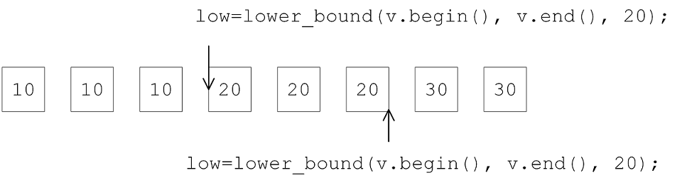

# 3 算法

## 3.1 C++标准库的算法，是什么东西？

1. 从语法层面讲

| 容器 container   | class template    |
| ---------------- | ----------------- |
| 算法 Algorithm   | function template |
| 迭代器 Iterator  | class template    |
| 仿函数 Function  | class template    |
| 适配器 Adapter   | class template    |
| 分配器 Allocator | class template    |

2.  算法就是一个函数模板  

```c++
template<typename Iterator>
Algorithm(Iterator, itr1, Iterator itr2)
{ ... }

template<typename Iterator, typename Cmp>
Algorithm(Iterator, itr1, Iterator itr2, Cmp comp)
{ ... }
// 算法第二版本：typename Cmp(准则),sort算法,比较大小的准则,大更小怎么定义
```

3. 算法用来对付容器，处理容器的。算法与容器各自闭门造车，各自独立；算法看不见容器，对其一无所知，算法所需要的一切信息都必须从迭代器取得，而迭代器（由容器提供）必须能够回答算法的所有提问，才能搭配该算法的所有操作，如果算法提出问题，迭代器回答不了，那么编译到那一行就出错了  


## 3.2 算法示例

### 3.2.1 C函数与C++标准库提供的算法区别

1. C 函数 sort、bsearch

```c++
qsort(c.data(), SIZE, sizeof(long), compareLongs);
```

```c++
long *pItem = (long *)bsearch(&target, (c.data()), ASIZE, sizeof(long), compareLongs);
```

2. C++标准库提供的算法，以函数的形式呈现

```c++
auto ite = find(c.begin(), c.end(), target);
```

```c++
sort(c.begin, c.end());
```

```c++
template<typename Iterator>
std::Algorithm(Iterator itr1, Iterator itr2, ...)
{ ... }
```


### 3.2.2 accumulate 累计

1. 调用：算法通常有两个版本，其中第二版本往往允许我们加上一个额外的原则或者一个操作

```c++
int myfunc(int x, int y) { return x + 2 * y; }

struct myclass {
    int operator()(int x, int y) { return x + 3 * y; }
} myobj; // 函数对象
/**********************************************************/
int init = 100;
int nums[] = { 10,20,30 };
accumulate(nums, nums + 3, init, myfunc);  // 220
accumulate(nums, nums + 3, init, myobj);   // 280
```

2. 源码

```c++
template <class InputIterator, class T>
T accumulate(InputIterator first, InputIterator last, T init) {
    for ( ; first != last; ++first)
        init = init + *first; // 将元素累加至初值init身上
    return init;
}

```

```c++
template <class InputIterator, class T, class BinaryOperation>
T accumulate(InputIterator first, InputIterator last, T init, BinaryOperation binary_op)
{
    for ( ; first != last; ++first)
        init = binary_op(init, *first) // 对元素[累计算]至初值init身上
    return init;
}
```

### 3.2.3 for_each

1. for_each的意思就是在一段区间/范围，对每一个元素做一件你所指定的事情

```c++
struct myclass
{
    void operator() (int i) { cout << ' ' << i; }
} myobj;
// 调用
vector<int> myvec;
for_each(myvec.begin(), myvec.end(), myobj);
```

2. 源码

```c++
template <class InputIterator, class Function>
Function for_each(InputIterator first, InputIterator last, Function f)
{
    for ( ; first != last; ++first)
        f(*first);
    return f;
}
```

### 3.2.4 replace, replace_if, replace_copy  

1. replace 取代

````c++
template <class ForwardIterator, class T>
void replace(ForwardIterator first, ForwardIterator last, const T& old_value, 
             const T& new_value)
{
    for ( ; first != last; ++first)           // 范围内所有等同于old_value者都以new_value取代
        if (*first == old_value) *first = new_value;
}
````

2. replace_if (if 表示给它一个条件)

```c++
template <class ForwardIterator, class Predicate, class T>
void replace_if(ForwardIterator first, ForwardIterator last, 
                Predicate pred,            // 判断式
                const T& new_value)
{
    for ( ; first != last; ++first)
        if (pred(*first)) 
            *first = new_value; // 范围内所有满足pred() 为true的元素都已new_value取代
}
```

3. replace_copy

```c++
// 范围内所有等同于old_value者都已new_value放置新区间，不符合者原值放入新区间
template <class InputIterator, class OutputIterator, class T>
OutputIterator replace_copy(InputIterator first, InputIterator last, 
                            OutputIterator result, const T& old_value, 
                            const T& new_value)
{
    for ( ; first != last; ++first, ++result)
        *result = *first == old_value ? new_value : *first;
    return result;
}
```

### 3.2.5 count, count_if 

1. count，count_if 源码

```c++
template <class InputIterator, class T, class Size>
void count(InputIterator first, InputIterator last, const T& value, Size& n)
{
    for ( ; first != last; ++first)  // 遍历
        if (*first == value)         // 如果元素值和value相等
        ++n;                         // 计数器累加 1
}
```

```c++
template <class InputIterator, class Predicate, class Size>
void count_if(InputIterator first, InputIterator last, Predicate pred, Size& n)
{
    for ( ; first != last; ++first)
        if (pred(*first))
            ++n;
}

```

2. 容器不带成员函数count() ： array、 vector、list、forward_list,、deque  

3. 容器带有成员函数count()：set/multiset、map/multimap、unordered_set/unordered_multiset

   unordered_map/unordered_multimap，用一个key找到value，

4. 容器带有的算法，就要使用容器自带的算法  

### 3.2.6 find， find_if

1. find， find_if 源码

```c++
template <class InputIterator, class T>
InputIterator find(InputIterator first, InputIterator last, const T& value)
{
    while (first != last && *first != value)  // 循序式 搜索/查找
        ++first;
    return first;
}
```

```c++
template <class InputIterator, class Predicate>
InputIterator find_if(InputIterator first, InputIterator last,
 Predicate pred)
{
    while (first != last && !pred(*first))
        ++first;
    return first;
}
```


### 3.2.7 sort

1. sort 调用

```c++
bool myfunc(int i, int j) { return (i < j); }

struct myclass {
    bool operator() (int i, int j) { return (i < j); }
} myobj;

void test_sort()
{
    int myints[] = { 32,71,12,45,26,80,53,33 };
    vector<int> myvec(myints, myints + 8);          // 32 71 12 45 26 80 53 33
    
    // using default comparison (operator <):
    sort(myvec.begin(), myvec.begin() + 4);         // (12 32 45 71) 26 80 53 33
    
    // using function as comp
    sort(myvec.begin() + 4, myvec.end(), myfunc); 	// 12 32 45 71 (26 33 53 80)
    
    // using object as comp
    sort(myvec.begin(), myvec.end(), myobj);        // (12 26 32 33 45 53 71 80)
    
    // using reverse iterators and default comparison (operator <):
    sort(myvec.rbegin(), myvec.rend());             // output: 80 71 53 45 33 32 26 12
}
```

2. 容器带有成员函数sort()， list，forward_list
3. 关联容器，在数据存储时,就已完成排序,因此不带成员函数sort()  

### 3.2.8 binary_search

1. 使用二分查找之前，必须先排序

```c++
template <class ForwardIterator, class T, class Compare>
bool binary_search(ForwardIterator first, ForwardIterator last, 
                   const T& value, Compare comp)
{
  ForwardIterator i = lower_bound(first, last, value, comp);
  return i != last && !comp(value, *i);
  // 获得的iterator所指的位置,即非end,目标值val亦不小于首元素(sorted rangc首元素值最小)
}
// 先判断 !(val < *first)然后才调用lower_bound将获得较佳效率
```



### 3.2.9 rbegin()  rend()

1. iterator_adapter

```c++
reverse_iterator rbegin()
{ return reverse_iterator(end()); }
reverse_iterator rend()
{ return reverse_iterator(begin()); }
```


