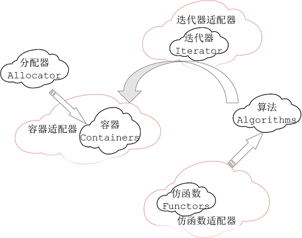

# 4 仿函数 functors

## 4.1 仿函数定义

1. 仿函数又称之为函数对象，其实就是重载了() 操作符的struct或class，没有什么特别的地方；仿函数只为算法服务，当算法需要一些特定的准则/操作，就可以利用函数/仿函数

   



## 4.2 仿函数分类

### 4.2.1 算术类

1. 加就加、减就减，为什么要把加根减或这些小动作设计为一个函数呢？因为你要把这些动作传到算法里边去，告诉它这个动作，所以你要写出一个函数或一个仿函数，算法拿到这些东西，才能做这些动作

```c++
template <class T>
struct plus : public binary_function<T, T, T> 
{
    T operator()(const T& x, const T& y) const 
    { return x + y; }
};
```

```c++
template <class T>
struct minus : public binary_function<T, T, T>
{
    T operator()(const T& x, const T& y) const 
    { return x - y; }
};
```

### 4.2.2 逻辑运算类 && 、||  

```c++
template <class T>
struct logical_and : public binary_function<T, T, bool>
{
    bool operator()(const T& x, const T& y) const
    { return x && y; }
};
```

### 4.2.3 相对关系类 < , > , =  

```c++
template <class T>
struct equal_to : public binary_function<T, T, bool> 
{
    bool operator()(const T& x, const T& y) const 
    { return x == y; }
};
```

```c++
template <class T>
struct less : public binary_function <T, T, bool>
{
    bool operator()(const T& x, const T& y) 
    const { return x < y; }
};
```


## 4.3 仿函数可适配条件

1. sort排序

```c++
// using default comparison(operator <)
sort(myvec.begin(), myvec.end());   
// using function as comp
sort(myvec.begin() + 4, myvec.end(), myfunc);
// using object as comp
sort(myvec.begin(), myvec.end(), myobj);
sort(myvec.begin(), myvec.end(), less<int>());
sort(myvec.begin(), myvec.end(), greater<int>());
```

2.  自己写的仿函数不继承binary_function，就表示没有融入STL体系结构里面，会带来那些问题?

   STL规定每个Adaptable Function都应挑选适当的继承，因为Function Adapter将会提问

```c++
bool myfunc(int i, int j) { return (i < j); }

struct myclass {
    bool operator() (int i, int j) { return (i < j); }
} myobj;
```


```c++
template <class _Tp>
struct greater : public binary_function<_Tp,_Tp,bool> 
{
    bool operator()(const _Tp& __x, const _Tp& __y) const { return __x > __y; }
};

template <class _Tp>
struct less : public binary_function<_Tp,_Tp,bool> 
{
    bool operator()(const _Tp& __x, const _Tp& __y) const { return __x < __y; }
};
// less继承binary_function,不会带来任何额外开销(不会占用内存),没有坏处,只有好处,less有了binary_function 三个typedef
```

3. 仿函数functors的可适配条件

   如果你希望你写的仿函数可以被适配，就要选择适当的unary_function 、binary_function 继承 ，因为Function Adapter会问first_argument_type、second_argument_type、result_type这些问题。

```c++
template <class Arg1, class Arg2, class Result>
struct binary_function        // 两个操作数
{
    typedef Arg1 first_argument_type;
    typedef Arg2 second_argument_type;
    typedef Result result_type;
};
```

```c++
template <class Arg, class Result>
struct unary_function         // 一个操作数的操作，比如说一个东西取它的否定
{
    typedef Arg argument_type;
    typedef Result result_type;
};
// 接收模板参数，把模板参数换了一个名字，没有data，没有function
```


```c++
template <class Operation> 
class binder2nd : public unary_function<typename Operation::first_argument_type,
                                        typename Operation::result_type>
{
protected:
    Operation op;
    typename Operation::second_argument_type value; // 你的第二实参是什么类型？
public:
    binder2nd(const Operation& x, 
              const typename Operation::second_argument_type& y) : op(x),value(y) {}

    typename Operation::result_type 
        operator() (const typename Operation::first_argument_type& x) const
    {
        return op(x, value);
    }
};
```

