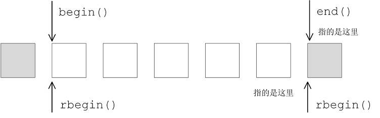
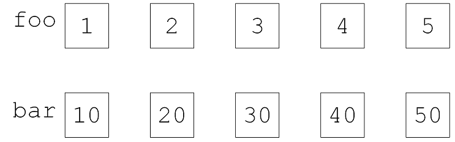
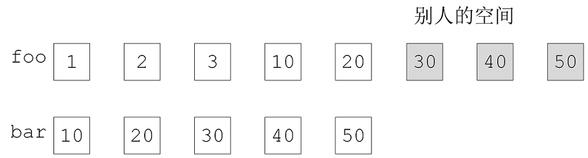
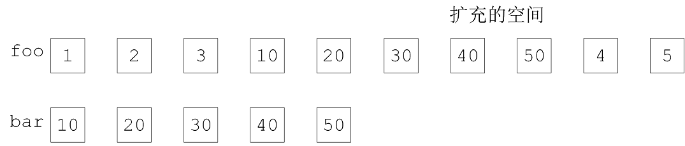

# 5 Adapters

1. adapters把某一个既有的东西，已经存在的东西，功能也不错的东西稍微改造一下，比如函数的接口改一下，类的名称改一下等 

2. 只要抓住适配器的关键共性，你的思路就豁然开朗。关键就是adapter，它要去改造某一个东西的话。比如A把B改造之后，A就代表B了。A就要面对大家，给大家使用，大家就不会再看到B了，而是会看到A。但是A自己所做的主要的事情，都是交给B去做，因为B是本来就有的一个好东西。所以A身为一个桥梁，是使用者与隐藏在幕后的B中间的一个桥梁。这就是A的作用，也就是adapter的作用。

   A要去取用B的功能。我们在编程的技术上，技巧上。两种做法。一个就是用继承的方式。A继承了B，当然也就可以取用它所有的资源。另外一种方式就是A内含B，我们就是要拥有或复合，在接下来我们要讨论的做法，都是用复合的做法。

## 5.1 存在多种Adapters

### 5.1.1 仿函数适配器(内含了一个Functors) 

1. 仿函数适配器作用也是主要和算法合作的，算法可能需要一些比如排序的准则,比大小的准则(从小到大或从大到小)，通过仿函数传进来的。可以把仿函数包成一个adapter后再传给算法。算法也可能想要知道某些问题，adapters本身也想要知道内含的functor的一些特性。需要通过问答的方式获得，也就是通过三个typedef

| typedef A1 first_argument_type;  |
| -------------------------------- |
| typedef A2 second_argument_type; |
| typedef R result_type;           |


### 5.1.2 迭代器适配器(内含了一个Iterator)


### 5.1.3 容器适配器(内含了一个Container)

1. 容器适配器：queue与stack 内含容器deque

```c++
template <class T, class Sequence = deque<T> >
class stack
{
public:
    typedef typename Sequence::value_type value_type;
    typedef typename Sequence::size_type size_type;
    typedef typename Sequence::reference reference;
    typedef typename Sequence::const_reference const_reference;
protected:
    Sequence c;                                         // 内含底层容器 deque
public:
    bool empty() const { return c.empty(); }
    size_type size() const { return c.size(); }
    reference top() { return c.back(); }
    const_reference top() const { return c.back(); }
    void push(const value_type& x) { c.push_back(x); }  // 改名
    void pop() { c.pop_back(); }
};
```

2. 改造的方法 

* 比如内含的容器有100个函数，只开放6个就可以了

* 容器函数名push_back，改为push `void push(const value_type& x) { c.push_back(x); }`

## 5.2 仿函数适配器

### 5.2.1 Binder2nd

1. Binder2nd 源码分析

```c++
cout << count_if(vi.begin(), vi.end(), not1(bind2nd(less<int>(), 40)));
less<int>
// 实现 x < y 并推导参数和返回类型的函数对象
bind2nd(less<int>(), 40); 
// 将less<int>()的第二参数 y 绑定为40,实现 x < 40 的操作,less<int>()是一个对象,而不是函数调用
```

```c++
template <class InputIterator, class Predicate>
typename iterator_traits<InputIterator>::difference_type
count_if(InputIterator first, InputIterator last, Predicate pred) 
{
     typename iterator_traits<InputIterator>::difference_type n = 0;
    for ( ; first != last; ++first) // 如果元素带入pred的结果为true,计数器累加1
        if (pred(*first))           //1 调用class binder2nd的operator()函数
            ++n;
    return n;
}
```


2. 使用bind2nd(less<int\>(), 40)的时候，我说比大小，比得的整数，所以后面绑定的第二实参一定要是整数，不然让帮我检查出来，帮我检查出来是好事情
3. typedef typename Operation::second_argument_type arg2_type; adapter就来问问题，Operation的第二实参是什么类型，arg2_type(x) 看看x能不能转为arg2_type 这种类型；40是不是是我问出来的类型，如果不能转换，编译就会报错。

```c++
// 函数模板可以做实参推导,编译器自动推导出less<int>()的类型
// 自动推导出的type作为类模板binder2nd的模板参数
template <class Operation, class T>
inline binder2nd<Operation> bind2nd(const Operation& op, const T& x)
{
    typedef typename Operation::second_argument_type arg2_type;
    return binder2nd<Operation>(op, arg2_type(x)); 
                                     // 创建binder2nd类的临时对象，调用binder2nd类的构造函数
}

template <class Operation> 
class binder2nd : public unary_function<typename Operation::first_argument_type,
                                        typename Operation::result_type>
{
protected:
    Operation op; // 内部成员，分别用以记录算式和第二实参   //记录less
    typename Operation::second_argument_type value;  // 记录40
public:
    binder2nd(const Operation& x,
              const typename Operation::second_argument_type& y)
      : op(x), value(y) {}   // 记录算式和第二实参

    typename Operation::result_type operator()
    (const typename Operation::first_argument_type& x) const // count_if
    {
        return op(x, value); // 2 实际呼叫算式,并取value为第二实参
    }
};
```

4. 仿函数functors可适配(adaptable) 条件？bind2nd()绑定/修饰less  ( less是一个两个操作数的动作，比较x与y两个操作数)，可能出现什么样的提问根回答呢？

* 你的第一实参y是什么type呀？( Operation::first_argument_type ) 
* 你的第二实参y是什么type呀？( Operation::second_argument_type ) 
*  x与y比较完之后result是什么type？（ Operation::result_type ）

5. typedef **typename** Operation::second_argument_type arg2_type;

* typename 这是因为帮助编译器通过代码。编译器再编译的时候 Operation 是什么还不知道，Operation 是在实参传进来时，才被实参编译器推导出来。编译器在第一次编译时，也不知道 Operation:: 能不能通过，Operation:: 将来要是一个无法回答 Operation::second_argument_type 问题的东西怎么办呢？

6. less是一个仿函数，binder2nd 修饰less后，它本身又形成一个functor。本身形成的这个functor，如果再被adapter的话，它也要能回答（仿函数functors可适配(adaptable) 条件？）这些问题。所以，binder2nd 又继承了 unary_function。我本身去代表别人，那我本身的身份就是被我代表的那种人的身份，那我还需不需要再别人代表呢？被人家adapter，被人家改造呢？如果希望的话，我也要继承该被继承的东西

```c++
template <class Arg, class Result>
struct unary_function
{
    typedef Arg argument_type;
    typedef Result result_type;
};
```

7. bind1st表示我们绑定第一个参数，bind2nd表示我们绑定第二个参数。not1表示跟想要的相反。


### 5.2.2 仿函数适配器 not1

1. 程序就像是乐高积木，bind2nd 适配 bind2nd(less<int\>(), 40) ，形成一个新的Functor

```c++
count_if(vi.begin(), vi.end(), not1(bind2nd(less<int>(), 40)));
```

2. not1 源码分析

```c++
// 辅助函式,使user得以方便使用unary_negate<Pred>
// bind2nd(less<int>(), 40) 传递进来进行，实参推导出 pred 的type
template <class Predicate>
inline unary_negate<Predicate> not1(const Predicate& pred)
{
    return unary_negate<Predicate>(pred); // 调用class unary_negate 的构造函数，创建对象
}
```


```c++
template <class Predicate>
class unary_negate : public unary_function<typename Predicate::argument_type, bool>
{
protected:
    Predicate pred;      // 内部成员
public:
    explicit unary_negate(const Predicate& x) : pred(x) {}
    bool operator()(const typename Predicate::argument_type& x) const
    {
        return !pred(x); // 将pred的运算结果‘取否’（negate）
    } 
};
```

### 5.2.3 仿函数适配器 bind

1. std::bind 可以绑定

> 1  functions            2  function objects 仿函数    3 member functions（必须是某个object地址）
>
> 4 data_members （必须是某个object地址）

2. bind使用

```c++
using namespace std::placeholders;               // 占位符_1 , _2, _3,...
double my_divide(double x, double y) {
    return x / y;
}

struct MyPair {
    double a, b;
    double multiply()  { return a * b; }
};

int main()
{
    // bind绑定functions
    auto fn_five = bind(my_divide, 10, 2);             // 5
    cout << fn_five() << endl;

    auto fn_half = bind(my_divide, _1, 2);             // 5    _1 占位第一参数
    cout << fn_half(10) << endl;

    auto fn_invert = bind(my_divide, _2, _1);          // 0.2  _2 占位第二参数 _1 占位第一参数
    cout << fn_invert(10, 2) << endl;

   // bind<int> 表示返回值类型为int； 未加模板参数，返回值类型就是你绑定的可调用对象的返回
    auto fn_rounding = bind<int>(my_divide, _1, _2);   // 3
    cout << fn_rounding(10, 3) << endl;

    // bind绑定成员函数    member function其实有个实参：this
    MyPair ten_two{10, 2};                              // 调用bound_memfn()要传this这个东西
    auto bound_memfn = bind(&MyPair::multiply, _1);     // _1 表示this;return x.multiply()
    cout << bound_memfn(ten_two) << endl;               // 20

    auto bound_memdata = bind(&MyPair::a, ten_two);     // return ten_two.a
    cout << bound_memdata() << endl;                    // 10
    // bind 成员数据 
    auto bound_memdata2 = bind(&MyPair::b, _1);         // return x.b
    cout << bound_memdata2(ten_two) << endl;            // 2
    
    vector<int> v{12, 38, 62, 57, 88, 13, 99};
    cout << count_if(v.begin(), v.end(), bind(less<int>(), _1, 50)) << endl; // less小于50
}
```


## 5.3 迭代器适配器 


### 5.3.1 reverse_iterator

1. 排序：由大到小排序两种做法

> 1 特别的比较准则
>
> 2 默认的准则，头到尾的准则完全相反，如果由头到尾是有小到大，那么有尾到头，就是由大到小



2. 正向的头，就是逆向的尾巴；逆向的尾巴，就是正向的头

```c++
reverse_iterator rbegin()
{ return reverse_iterator(end()); }
```

```c++
reverse_iterator rend()
{ return reverse_iterator(begin()); }
```

3. reverse_iterator源码 - adapter就是把它所要改造或修饰的东西记下来，然后再看看你要怎么改造它；

```c++
template <class Iterator>
class reverse_iterator 
{
protected:
    Iterator current;                                 // 对应正向迭代器
public:
    // 逆向迭代器的5种相关类型都和其对应的正向迭代器相同
    typedef typename iterator_traits<Iterator>::iterator_category  iterator_category;
    typedef typename iterator_traits<Iterator>::value_type  value_type;
    ...
    typedef Iterator iterator_type;                   // 代表正向迭代器
    typedef reverse_iterator<Iterator> self;          // 代表逆向迭代器
public:
    reverse_iterator() {}
    explicit reverse_iterator(iterator_type x) : current(x) {}
    reverse_iterator(const self& x) : current(x.current) {}   
    
    iterator_type base() const { return current; }    // 取出对应的正向迭代器
    
    reference operator*() const { Iterator tmp = current; return *--tmp; }
    // 以上关键所在, 对逆向迭代器取值，就是将对应之正向迭代器退一位取值
    
    // 正向++,就是逆向—-
    self& operator++() { --current; return *this; }
    // 正向--,就是逆向++
    self& operator--() { ++current; return *this; }
    self operator+(difference_type n) const { return self(current -n); }
    self operator-(difference_type n) const { return self(current +n); }
}
```


### 5.3.2 迭代器适配器 inserter 

1. 将数组的数据复制到vector  

```c++
int myints[] = {10,20,30,40,50,60,70};
vector<int> myvec(7);

copy(myints, myints+7, myvec.begin());
//copy只知道目的端的头,不知道目的端的尾部空间在哪里，合不合法，不知道可不可以放东西进去，myvec目的端不够多，复制到不该放的地方，程序存在隐患。inserter就可以不必担心这个问题。insert表示做一个空间出来，放东西
```


2. copy 出错的情况

```c++
list<int> foo, bar;
for(int i = 1; i <=5; i++)
{
    foo.push_back(i);
    bar.push_back(i*10);
}
list<int>::iterator it = foo.begin();
advance(it, 3);     //链表上不连续空间,advance函数,将当前节点向后推3个节点,相当于it + 3
copy(bar.begin(), bar.end(), it); // copy出错
```







3. inserter动作

```c++
copy(bar.begin(), bar.end(), inserter(foo, it));
// 目的端的迭代器改为insert的动作
```



4. copy 源码

```c++
// copy(来源端头, 来源端尾, 目的端的头); 
template <class InputIterator, class OutputIterator>
OutputIterator copy(InputIterator first, InputIterator last, OutputIterator result)
{
    while(first != last)
    {
        *result = *first;    // copy的代码已经写好了，还可以改变它的行为；result对赋值操作符重载 
        ++result; ++first;
    }
    return result;
}
```

5. insert_iterator源码

```c++
// 辅助函数,帮助 user 使用insert_iterator
template <class Container, class Iterator>
inline insert_iterator<Container> inserter(Container&  x,  Iterator i) // 参数：容器 迭代器
{
    typedef typename Container::iterator iter;
    return insert_iterator<Container>(x, iter(i));
}
```

```c++
// 这个adapter将iterator的赋值操作改为安插(insert)操作,并将iterator右移动一个位置
// 如此便可以让user连续执行[表面上赋值,而实际上安插的行为]
template <class Container>
class insert_iterator 
{
protected:
    Container* container;                 // 底层容器  x
    typename Container::iterator iter;    // 迭代器    i
public:
    typedef output_iterator_tag iterator_category;
    ....     
    insert_iterator(Container& x, typename Container::iterator i):container(&x), iter(i)     {}
 
    // 操作符重载了copy函数的 " = " (*result = *first;)
    insert_iterator<Container>& operator=(const typename Container::value_type& value)
    { 
        iter = container->insert(iter, value);  // 调用容器的 insert()
        ++iter;                                 // 令insert iterator永远随其target贴身移动
        return *this;
    }
}
```


## 5.4 x 适配器


### 5.4.1 istream_iterator 

1. 使用

```c++
int main() {
	std::vector<int> myvector;
	for (int i = 1; i < 10; i++)
		myvector.push_back(i * 10);
    // 当你把元素丢到这个迭代器所指的位置，其实就是丢给cout，也就是在你的屏幕上出现喽
	std::ostream_iterator<int> out_it(std::cout, ",");
	std::copy(myvector.begin(), myvector.end(), out_it);
	return 0;
}
```

2. copy源码

```c++
template <class InputIterator, class OutputIterator>
OutputIterator copy(InputIterator first, InputIterator last, OutputIterator result)
{
    while(first != last)
    {
        *result = *first; // inserter
        ++result; ++first;
    }
    return result;
}
// 可作用在result身上操作符 * 、 = 、 ++、 return result（拷贝构造也会作用在result身上）
```

4. ostream_iterator源码  

```c++
template <class T>
class ostream_iterator {
protected:
    ostream* stream; 
    const char* string;
public:
    typedef output_iterator_tag iterator_category;
    ......

    ostream_iterator(ostream& s) : stream(&s), string(0) {}
    ostream_iterator(ostream& s, const char* c) : stream(&s), string(c)  {}
    // std::cout 放到 s， , 号 放到 c
  
    ostream_iterator<T>& operator=(const T& value) { 
        *stream << value;                // cout输出元素(*first)
        if (string) *stream << string;   // cout输出 , 号
        return *this;
    }
  
    ostream_iterator<T>& operator*() { return *this; }
    ostream_iterator<T>& operator++() { return *this; } 
    ostream_iterator<T>& operator++(int) { return *this; } 
}
```


### 5.4.2 istream_iterator

1. 使用 - 1

```c++
int main()
{
	double value1, value2;
	std::cout << "Please, insert two values: ";
	std::istream_iterator<double> eos;             // end-of-stream iterator
	std::istream_iterator<double> iit(std::cin);   // stdin iterator  相当于 cin >> value
	if (iit != eos) value1 = *iit;                 // 相当于 return value

	++iit;
	if (iit != eos) value2 = *iit;
	std::cout << value1 << "*" << value2 << "=" << (value1*value2) << "\n";
}
```

2. 使用 - 2

```c++
int main()
{
	std::vector<int> v;
	std::istream_iterator<int> iit(std::cin), eos;
	copy(iit, eos, inserter(v, v.begin()));
	return 0;
}
```


