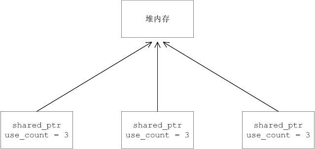
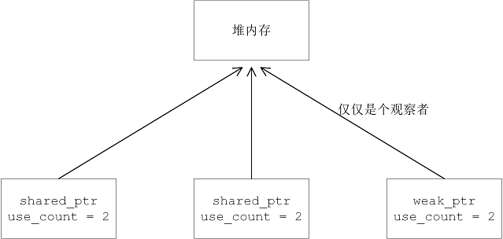

# 1 C++标准库 智能指针

1. 智能指针是存储指向动态分配(堆) 对象指针的类，用于生存期控制，能够确保在离开指针所在作用域时，自动正确地销毁动态分配的对象，防止内存泄漏。通用实现技术是引用计数

## 1.1 auto_ptr 拥有严格对象所有权


## 1.2 unique_ptr 独占的智能指针


## 1.3 shared_ptr 共享的指针指针

1. shared_ptr 使用引用计数，每一个shared_ptr 的拷贝都指向相同的内存。在最后一个shared_ptr 析构的时候，内存才会被释放。

### 1.3.1 初始化

1. 未初始化的智能指针，可以用reset初始化。当智能指针有值的时候，调用reset会使引用计数减 1


## 1.4 weak_ptr弱引用的指针指针


# 2 boost库 智能指针

1. 智能指针采用RAII机制（resource acquisition is initialization）资源获取就是初始化，通过对象来管理指针，构造对象时，完成资源的初始化，析构对象时，对资源进行清理释放，C++98标准引入auto_ptr ,但设计不完善

2. auto_ptr之间不能共享拥有权，**但可以通过赋值或构造转移拥有权**，一旦拥有权转移，不可以再次使用此auto_ptr，程序员必须防范一个原始指针被两个auto_ptr 所拥有
3. auto_ptr 使用

```c++
class A
{
public:
    A(int _a):m_a(_a) { cout << "构造A类对象" << endl; }
    ~A() { cout << "析构A类对象" << endl; }
    int m_a;
};

int main()
{
    // C++98的auto_ptr 
    auto_ptr<A> p1(new A(100));
    cout << p1->m_a << endl;      // 100
    auto_ptr<A> p2(p1);           // 调用拷贝构造函数，拥有权p1转移到p2,此时p1已经为null
    // p1->m_a = 23;              // Error p1 = null,为p1赋值，会发生段错误
    auto_ptr<A> p2;
    p2 = p1;                      // 调用赋值构造函数，转移拥有权
}
```


## 2.1 scoped_ptr

1. scoped_ptr 与auto_ptr 很类似，但最大的区别就是它不能转让管理权，也就说，**scoped_ptr 禁止用户进行拷贝构造与赋值**

```c++
// 拷贝构造函数和赋值构造 定义为私有
template<class T> class scoped_ptr
{
private:
    T * px;
    scoped_ptr(scoped_ptr const &);
    scoped_ptr & operator=(scoped_ptr const &);
}
```

2. 头文件#include <boost/**scoped_ptr.hpp**>  

3. scoped_ptr 使用

```c++
class A
{
public:
    A(int _a):m_a(_a) { cout << "构造A类对象" << endl; }
    ~A() { cout << "析构A类对象" << endl; }
    int m_a;
};
// 调用
scoped_ptr<A> s1(new A(100));
scoped_ptr<A> s2(s1);          // Error 拷贝构造函数是private
scoped_ptr<A> s3;
s3 = s1;                       // Error 赋值构造函数是private
```


## 2.2 scoped_array

1. 以下代码有没有问题？**scoped_ptr不接受数组指针**

```c++
class A
{
public:
    A(int _a):m_a(_a) { cout << "构造A类对象" << endl; }
    ~A() { cout << "析构A类对象" << endl; }
    int m_a;
};

scoped_ptr<A> s1(new A[5]);    // 传入对象数组指针（构造5次，只析构一次）
// scoped_ptr不能接受数组指针, scoped_ptr的析构函数，只delete一次
```

2. scoped_array 管理new出来的对象，scoped_array与scoped_ptr很类似，它包装了new[] 操作符（而不是new）在堆上分配的动态数组，弥补了标准库中没有指向数组的智能指针

3. 头文件 #include <boost/scoped_array.hpp>  

4. scoped_array与scoped_ptr区别

| 区别         | scoped_array                                            | scoped_ptr            |
| ------------ | ------------------------------------------------------- | --------------------- |
| 接收指针     | new[]                                                   | new                   |
| 内部指针     | 不支持 *   ->操作符重载                                 | 普通指针，支持*  ->   |
| 析构函数实现 | 使用delete[]                                            | 使用delete            |
| 支持索引访问 | 提供operator[] 重载，可以像普通数组一样使用下标访问元素 | 不支持operator[] 重载 |
| 容器操作     | 无begin(), end()                                        | 无begin() , end()     |

5. scoped_array 使用

```c++
class A
{
public:
    A(int _a):m_a(_a) { cout << "构造A类对象" << endl; }
    ~A() { cout << "析构A类对象" << endl; }
    int m_a;
};

int main()
{
    scoped_array<A> s2(new A[5]);   // 指向数组内存地址的智能指针，与普通数组指针类似
    for(int i = 0; i < 5; i++)
        s2[i].m_a = i;              // 支持[]访问，把s2当做数组名 不支持 (s2 + i).m_a = i; 
    cout << p2[4].m_a << endl;      // 智能指针 用索引访问
}
```


## 2.3 shared_ptr

### 2.3.1 shared_ptr使用

1. shared_ptr 是可以共享所有权的指针；如果有多个shared_ptr 共同管理同一个对象时，只有这些shared_ptr全部与该对象分离之后，被管理的对象才会释放
2. 头文件 #include <boost/make_shared.hpp> 或 #include <boost/shared_ptr.hpp>
3. shared_ptr使用引用计数，每一个shared_ptr的拷贝都指向相同的内存，每关联一次，内部的引用计数加1




4. 使用

```c++
class A
{
public:
    A(int _a):m_a(_a) { cout << "构造A类对象" << endl; }
    ~A() { cout << "析构A类对象" << endl; }
    int m_a;
};

int main() 
{
    boost::shared_ptr<A> s1(new A);                          // 构造A类对象
    cout << s1.unique() << "," << s1.use_count() << endl;    // 1, 1
    // 此时p1,p2同时管理A的内存
    boost::shared_ptr<A> s2(s1);                             // 拷贝构造 引用计数加1
    cout << s1.unique() << "," << s1.use_count() << endl;    // 0, 2
    // p1,p2,p3 三个智能指针指向同一快内存地址
    boost::shared_ptr<A> s3;
    s3 = s1;                                                 // 赋值构造 引用计数加1
    cout << p1.unique() << "," << p1.use_count() << endl;    // 0, 3
    // 手动分离管理权
    p1.reset();                                              // 引用计数减1
    p2.reset();                                              // 引用计数减1
    p3.reset();                                   // 引用计数减1，此时全部放弃管理权，A的内存释放
}
```

### 2.3.2 shared_ptr使用陷阱

1. 不能把栈地址赋给 scoped_ptr，scoped_array， shared_ptr

```c++
int a = 10;
// 不能管理栈内存
boost::shared_ptr<int> p1(&a);
cout << p1.use_cout() << endl; // 编译通过、运行出错
```

2. shared_ptr 不能多次引用同一原始指针，否则同一内存会被delete多次  

```c++
A *pA = new A;
boost::shared_ptr<A> p1(pA);
cout << p1.use_cout << endl;
// boost::shared_ptr<A> p2(p1); // 正确写法
boost::shared_ptr<A> p2(pA);    // Error p2并不知道p1的存在
cout << p2.use_cout << endl;    // p1 p2在对象析构时，会各自delete pA，从而报错
```

3. shared_ptr 循环引用导致内存泄漏  

```c++
class B;                            //类的前置声明
class A
{
public:
    A()  { cout << "构造A类对象" << endl; }
    ~A() { cout << "析构A类对象" << endl; }
    boost::shared_ptr<B> m_pb;      // 指向B的内存
};

class B
{
public:
    B()  { cout << "构造B类对象" << endl; }
    ~B() { cout << "析构B类对象" << endl; }
    boost::shared_ptr<A> m_pa;      // 指向A的内存
};

int main()
{
    boost::shared_ptr<A> pA(new A);
    boost::shared_ptr<B> pB(new B);
    cout << pA.use_count() << " "  << pB.use_count() << endl;  // 1  1

    pA->m_pb = pB;                  // pB指向的内存引用计数为2 
    pB->m_pa = pA;                  // pA指向的内存引用计数为2 
    cout << pA.use_count() << " "  << pB.use_count() << endl;  // 2  2
    // 此刻，pA，pB都析构时，都只会将引用计数-1，各自剩余引用计数为1，不会释放，从而导致内存泄漏
}
```

4. shared_ptr 使用的是delete来删除内存，因此要注意内存是否是new出来的 

```c++
int *pInt = (int *)malloc(sizeof(int));
boost::shared_ptr<int> p(pInt);     //delete 无法释放malloc分配的内存
```


## 2.4 make_shared

1. shared_ptr 消除了显式的delete调用，很大程序上避免了程序员忘记delete而导致的内存泄漏，但shared_ptr的构造依然需要new，这导致了代码中的某种不对称，它应该使用工厂模式来解决。
2. boost库提供了一个自由工厂函数make_shared<T>(),来消除显式的new调用，声明如下：

```c++
template<class T, class… Args>
shared_ptr<T> make_shared(Args &&… args);
```

3. make_shared() 函数模板使用变长参数模板，最多可接受10个参数，然后把它们传递给T的构造函数，创建一个shared_ptr<T\> 的对象并返回。make_shared()函数要比直接创建shared_ptr对象的方式更高效，因为它内部仅分配一次内存
4. 使用时需要包含头文件 #include <boost/make_shared.hpp>

5. make_shared 使用

```c++
class A
{
public:
    A(int a,float b,char c,string d)
    {  cout << "构造A类对象" << endl;  }
    ~A() {  cout << "析构A类对象" << endl;  }
    int a;
    float b;
    char c;
    string d;
};

int main()
{
    // 原始的方式构造shared_ptr,需要new，产生一种不对称性
    boost::shared_ptr<A> p1(new A(100, 2.34f, 'C', "acde"));
    //推荐使用工厂函数，屏蔽new,更高效
    boost::shared_ptr<A> p2 = boost::make_shared<A>(100, 2.34f, 'C', "abcde");
    return 0;
}
```


## 2.5 shared_array

1. shared_ptr 不接受数组指针，delete不能释放数组内存指针

```c++
class A
{
public:
    A()  { cout << "构造A类对象" << endl; }
    ~A() { cout << "析构A类对象" << endl; }
};

int main()
{
    A *pArr = new A[3];
    boost::shared_ptr<A> p1(pArr);  // delete不能释放数组内存指针，应该用delete[]
}
```

2. shared_ptr包装了new[]操作符在堆上分配的动态数组，同样使用引用计数机制为动态数组提供了一个代理，可以在程序的生命周期里长期存在，直到没有任何引用后才释放内存。
3. 头文件：#include <boost/shared_array.hpp>

4. shared_ptr与shared_array区别

| 区别         | shared_array                                            | shared_ptr            |
| ------------ | ------------------------------------------------------- | --------------------- |
| 接收指针     | new[]                                                   | new                   |
| 内部指针     | 不支持 *   ->操作符重载                                 | 普通指针，支持*  ->   |
| 析构函数实现 | 使用delete[]                                            | 使用delete            |
| 支持索引访问 | 提供operator[] 重载，可以像普通数组一样使用下标访问元素 | 不支持operator[] 重载 |
| 容器操作     | 无begin(), end()                                        | 无begin() , end()     |

5. shared_array使用

```c++
class A
{
public:
    A()  { cout << "构造A类对象" << endl; }
    ~A() { cout << "析构A类对象" << endl; }
};

int main()
{
    A *pArr = new A[5];
    boost::shared_array<A> p1(pArr);   // 适合数组内存指针
    boost::shared_array<A> p2(p1);
    for(int i = 0; i < 5; i++)
    {
        p1[i].m_a = i;                 // 使用索引访问
    }
    cout << p1[2].m_a;
}
```


## 2.6 weak_ptr

### 2.6.1 weak_ptr 使用

1. 设计的目的是为了来协助shared_ptr 工作，它可以从一个shared_ptr 或另一个weak_ptr对象构造，它的构造和析构不会引起引用计数的增加或减少
2.  头文件 #include<boost/weak_ptr.hpp>
3. shared_ptr 构造或析构导致引用计数加减 1，而weak_ptr 不会引起引用计数的改变




4. weak_ptr与shared_ptr区别

| 区别         | weak_ptr                                | shared_ptr                   |
| ------------ | --------------------------------------- | ---------------------------- |
| 构造         | weak_ptr 、shared_ptr构造               | new、shared_ptr构造          |
| 指针功能     | 不支持 * 、-> 操作符重载                | 支持 * 、 -> 操作符重载      |
| 引用计数改变 | 不影响对应的shared_ptr内部引用计数      | 改变引用计数                 |
| 成员函数     | use_count 返回引用计数                  | use_count 返回引用计数       |
| 成员函数     | expired 检测所管理的对象是否释放        | unique 返回是否是独占所有权  |
| 成员函数     | reset 将 weak_ptr 置空                  | reset 放弃所有权并使计数 -1  |
| 成员函数     | swap 交换两个weak_ptr 对象              | swap 交换两个shared_ptr 对象 |
| 成员函数     | lock 创建新的 weak_ptr 对象并使计数 + 1 | get 返回内部对象(指针)5.     |

5. weak_ptr 使用

```c++
class A
{
public:
    A()   {  cout << "构造A类对象" << endl;  }
    ~A()  {  cout << "析构A类对象" << endl;  }
};
int main()
{
    boost::shared_ptr<A> p1(new A);
    cout << p1.unique() << " ," << p1.use_count() << endl;   // 1   1
    // weak_ptr不管理这块内存 p2->m_a; *p2.m_a = 100 错误用法
    // weak_ptr 是shared_ptr的协助者，或者是一个配角，主要用于观察
    boost::weak_ptr<A> p2(p1);                               // 不改变引用计数
    cout << p2.expired() << " ," << p2.use_count() << endl;  // 0   1
                                                             //expired()返回1 表示内存已释放
    boost::shared_ptr<A> p3(p1);                             //引用计数+1    
    cout << p2.expired() << " ," << p2.use_count() << endl;  // 0   2
    p1.reset();                                              // 引用计数-1
    cout << p2.expired() << " ," << p2.use_count() << endl;  // 0   1
}
```

### 2.6.2 weak_ptr 应用场景

1. weak_ptr() 并不能作为一个单独指针使用：不能-> 访问，* 解引用，也不能检查是否为空，它仅仅作为shared_ptr 的观察者。
2. 它一般运用于如下场景：

* 检查管理的内存是否释放
* 解决循环引用问题

3. 检查管理的内存是否释放：在使用weak_ptr时，我们一般会先用expired() 判断其是否过期，如果没有过期则可访问所管理的资源，但weak_ptr并不能操作资源，当我们想要访问weak_ptr所指向的资源时，应使用lock()方法获取一个shared_ptr，通过shared_ptr来访问资源。  

```c++
class A
{
public:
    A()   {  cout << "构造A类对象" << endl;  }
    ~A()  {  cout << "析构A类对象" << endl;  }
    int   m_a;
};

int main()
{
    boost::shared_ptr<A> p1(new A);                           // 引用计数 = 1
    p1->m_a = 100;
    boost::shared_ptr<A> p2(p1);                              // 引用计数 + 1
    cout << p1.use_count() << "," << p2.use_count() << endl;  // 2  2
    
    boost::weak_ptr<A> w1(p1);                                // 不影响引用计数
    cout << w1.expired() << "," << w1.use_count() << endl;    // 0  2

    p1.reset();                                               // 让p1释放管理权 引用计数-1
    cout << p1.get() << "," << p1.use_count() <<endl;         // 00000000   0

    // 通过 w1 来观察，虽然p1放弃管理权，但 w1 依然能正常工作
    cout << w1.expired() << "," << w1.use_count() << endl;    // 0  1
    
    if(w1.expired())                                          // 内存释放
        cout << "内存释放" << endl;
    else
    {
        // cout << p1->m_a << endl; Error p1已放弃管理权； w1->m_a; weak_ptr不能 -> 或 *
        boost::shared_ptr<A> p3 = w1.lock();                  // 可以使用lock返回shared_ptr
        cout << p3->m_a << endl;                              // 100   
    } 
}
```

4. 解决循环引用问题

```c++
// 循环引用，导致内存泄漏
class A
{
public:
    A()  { cout << "构造A类对象" << endl; }
    ~A() { cout << "析构A类对象" << endl; }
    boost::shared_ptr<A> m_a;                                 // boost::weak_ptr<A> m_a;
};
int main()
{
    boost::shared_ptr<A> p1(new A);                           // 引用计数 = 1
    cout << p1.unique() << "," << p1.use_count() << endl;     // 1  1
    p1->m_a = p1;                                             // 导致循环引用，引用计数 +1
    cout << p1.unique() << "," << p1.use_count() << endl;     // 0  2
}
```


```c++
int main()
{
    {
        boost::shared_ptr<A> p1(new A);                        // 引用计数 = 1
        cout << p1.unique() << "," << p1.use_count() << endl;  // 1  1

        p1->m_a = p1;                                          // 导致循环引用
        cout << p1.unique() << "," << p1.use_count() << endl;
    }
}
加括号，到这里时候,p1生命周期结束，产生析构，导致引用计数 -1，但是引用计数还是大于0，所以new A这块内存不会被释放，所以m_a 成员也不会释放，这样导致了引用计数一直不为0，则new A的这块内存泄漏
解决方案就是类A的成员 m_a改为：boost::shared_ptr<A> m_a；换成boost::weak_ptr<A> m_a;
```

